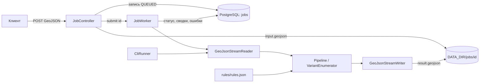
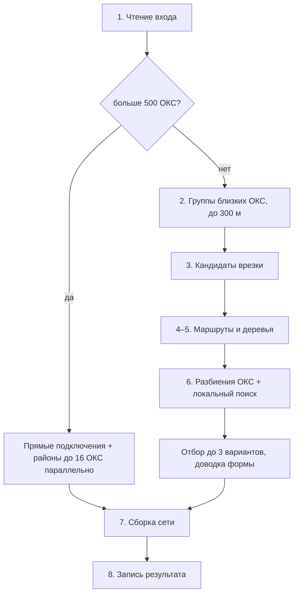

# Документация сервиса трассировки тепловых сетей

Выжимка в одном файле: как запустить и проверить сервис, как он устроен, сколько времени считает и какой S даёт, почему выбраны именно такие решения. Подробности лежат в [INSTRUCTION.md](INSTRUCTION.md), [ARCHITECTURE.md](architecture/ARCHITECTURE.md), [performance.md](docs/performance.md) и [ADR](docs/adr/).

На датасете организаторов: **S 12,748**, подключены 17 точек из 17, расчёт идёт 3,2 с.

---

## 1. Как запустить и проверить

Все команды выполняются из корня репозитория. Пример входа лежит в `data/samples/small-1.geojson`.

| Способ | Когда подходит | Что нужно |
|---|---|---|
| A. Docker Compose | REST API и Swagger, как в эксплуатации | Docker |
| B. Командная строка | посчитать файл, без веба и базы | JDK 11 и Maven/Gradle, либо только Docker |
| C. jar с PostgreSQL | API без Docker | JDK 11, PostgreSQL |

### A. Docker Compose

```bash
docker compose up -d --build
curl http://localhost:8080/actuator/health                    # ждём {"status":"UP"}

curl -s -X POST -H 'Content-Type: application/geo+json' \
  --data-binary @data/samples/small-1.geojson http://localhost:8080/api/v1/jobs   # → {"id":"…","status":"QUEUED"}

curl -s http://localhost:8080/api/v1/jobs/<id>                # ждём DONE или FAILED
curl -s http://localhost:8080/api/v1/jobs/<id>/result -o result.geojson

docker compose down -v
```

Swagger: `http://localhost:8080/swagger-ui/index.html`.

| Запрос | Что делает |
|---|---|
| `POST /api/v1/jobs` | принимает GeoJSON сырым телом и отвечает `202` с `id` |
| `GET /api/v1/jobs` | список задач |
| `GET /api/v1/jobs/{id}` | статус `QUEUED` / `RUNNING` / `DONE` / `FAILED`, ошибки входа, сводки вариантов |
| `GET /api/v1/jobs/{id}/result` | выходной GeoJSON; пока задача не готова, отвечает `409` |
| `GET /api/v1/jobs/{id}/input` | исходный файл |

Переменные: `APP_PORT` (8080), `POSTGRES_HOST_PORT` (55432), `JOB_WORKERS` (2), `JAVA_OPTS`.

### B. Командная строка

```bash
mvn -B -DskipTests package          # или ./gradlew bootJar
java -jar target/heatnet.jar --cli data/samples/small-1.geojson data/out/small-1.geojson
```

В конце печатается `PIPELINE DONE variants=3 elapsed=…s`, а рядом с выходом появляется `*.criteria.json`. Коды выхода: `0` — готово, `2` — ошибки во входных данных (перечислены по объектам), `1` — любая другая ошибка.

Без JDK:

```bash
docker build -t heatnet .
docker run --rm -v "$PWD/data:/work" heatnet --cli /work/samples/small-1.geojson /work/out/small-1.geojson
```

### C. jar с API

Нужна база PostgreSQL, в которой база, пользователь и пароль называются `heatnet`. Таблица создаётся сама.

```bash
SPRING_DATASOURCE_URL=jdbc:postgresql://localhost:5432/heatnet java -jar target/heatnet.jar --server.port=18080
```

### Проверка результата

Независимый проверщик `check18.py` не использует код сервиса. Он проверяет выход по техническому приложению от 18.09.2026: ссылки, повороты, форму трасс, отступы, спецпроходы, диаметры, камеры, стоимость и сводку.

```bash
uv run --project tools python tools/validator/check18.py data/samples/small-1.geojson data/out/small-1.geojson
# последняя строка CHECK18 OK — нарушений нет

make run IN=<вход> OUT=<выход>                                   # расчёт и сразу проверка
python3 scripts/visualize.py <вход> <выход>                      # HTML-карта с вариантами, работает офлайн
```

### Что лежит в результате

Результат — один GeoJSON в EPSG:4326 с объектами до трёх вариантов (`variant_id`). Ранг 1 — лучший по S.

| `object_type` | Что это |
|---|---|
| `heat_network` | новый участок: диаметр, расход, длина, способ прокладки, стоимость |
| `heat_chamber` | новая камера: врезка в трубу или узел ветвления |
| `technical_node` | узел на границе специального прохода |
| `variant_summary` | сводка варианта: стоимость, длина, S, ранг, неподключённые ОКС |

### Большие файлы

Если зданий с точками подключения больше 500, включается городской режим. Для файла на 3 ГБ:

```bash
java -Xmx12g -XX:MaxNewSize=512m -jar target/heatnet.jar --cli big.geojson big-out.geojson
# через API:
JAVA_OPTS="-Xmx12g -XX:MaxNewSize=512m" JOB_WORKERS=1 docker compose up -d --build
```

`-XX:MaxNewSize=512m` не убирайте: без него молодое поколение кучи раздувается до гигабайт, и машина уходит в подкачку.

### Если не работает

| Что видно | Что сделать |
|---|---|
| сборка падает на компиляции | проверить, что `java -version` показывает 11 |
| `port is already allocated` | `APP_PORT=18080` или `POSTGRES_HOST_PORT=55433` |
| `FAILED` с перечнем объектов | во входе ошибки данных: у каждой записи есть `featureId`, поле и описание проблемы |
| `FAILED` после рестарта | очередь хранится в памяти, отправьте файл заново |
| `OutOfMemoryError` | увеличить `-Xmx`, `-XX:MaxNewSize=512m` оставить |

Все таблицы и коэффициенты кейса лежат в `rules/rules.json`. Другой файл правил задаётся через `--rules=<путь>` или `HEATNET_RULES`.

---

## 2. Как устроен сервис

### Общая схема

Сервис — одно приложение на Spring Boot. Ядро расчёта `Pipeline` не зависит от веба и базы: его вызывают и REST-воркер, и CLI.



| Пакет | Роль |
|---|---|
| `api` | REST, сущность задачи, воркер, обработка ошибок |
| `cli` | запуск из командной строки (профиль `cli` без веба и базы) |
| `core` | `Pipeline`; на каждый запуск создаётся новый `VariantEnumerator`, поэтому задачи друг другу не мешают |
| `io` | потоковое чтение и запись GeoJSON, перевод EPSG:4326 ↔ EPSG:32637 (метры) |
| `model` | входные объекты и объекты результата |
| `rules` | загрузка `rules.json`: диаметры, цены, отступы, коэффициенты |
| `graph` | зоны препятствий, граф видимости, кратчайший путь |
| `plan` | кандидаты врезки, деревья, варианты, сборка сети |
| `calc` | расходы, диаметры, стоимость, ранжирование, критерии |

**Жизненный цикл задачи:** `POST` потоком пишет тело на диск (без multipart, чтобы файл на 3 ГБ не держался в памяти) → в базу записывается `QUEUED` → воркер ставит `RUNNING`, считает, пишет `result.geojson` → `DONE` со сводками, которые берутся из готового файла, чтобы числа в API и в файле совпадали. Если во входе есть ошибки данных, задача получает `FAILED` со списком ошибок. После перезапуска сервиса незавершённые задачи тоже получают `FAILED`. Сами GeoJSON в базе не хранятся, там только пути к файлам.

### Расчёт по шагам



| Шаг | Классы | Что происходит |
|---|---|---|
| **1. Чтение** | `GeoJsonStreamReader` | Файл читается потоком блоками по 1 МБ, фичи разбирает пул потоков. Проходов два: сначала сеть и точки, потом только препятствия в рамке расчёта. Ошибки копятся как `Diagnostic`; если есть хоть одна, расчёт не запускается. Чего нет в датасете организаторов (направление сети, диаметр камер, расход), выводится по правилам из [interpretation.md](docs/interpretation.md) |
| **2. Группы и области** | `Region` | ОКС, чьи точки ближе 300 м друг к другу по цепочке, объединяются в группу. Для группы определяется диаметр ствола (по суммарному расходу плюс ступень запаса) и область графа (рамка +150 м, для повторной попытки широкая рамка +600 м) |
| **3. Кандидаты врезки** | `TieInFinder` | 3 ближайшие камеры и проекции на 3 ближайшие трубы. Камера подходит, если она ближе 10 м и в ней есть место. Иначе ставится новая камера на трубе. Врезку сервис по возможности уводит из дороги и её полосы, но камера в дороге допустима (разъяснение 13 от 29.09) |
| **4. Маршрут** | `ObstacleSet`, `ZoneGrid`, `Router` | Граф видимости: узлы стоят в выпуклых вершинах зон отступа, рёбра допустимы, если не заходят в запретные зоны, пересекают дорогу под углом от 45° и держат отступ от линий. Вес ребра — длина плюс надбавка `(Kспец − 1) × длина спецпрохода`. Дейкстра не пропускает повороты круче 90°. Затем путь спрямляется: `cutPass` срезает углы хордами, `sharpen` убирает лишние вершины, зигзаги и двойные повороты (п. 5 правил) |
| **5. Дерево врезки** | `TreeBuilder` | Эвристика Такахаши–Мацуямы: на каждом шаге присоединяется ОКС с самым дешёвым путём до уже построенного дерева, в точке касания ставится камера ветвления. Новая камера и лишний луч врезки добавляются к весу как надбавка. Финальный участок выходит из здания у ближайшей открытой стены (п. 2.2) |
| **6. Варианты и поиск** | `VariantEnumerator` | Черновики строятся по разбиениям ОКС: каждый ОКС отдельно, группами, группами, разбитыми k-means. От лучшего черновика идёт локальный поиск: слить блоки, перенести ОКС, выделить ОКС, разбить блок, сменить врезку. Бюджет — 1000 сборок, остановка после 100 сборок без улучшения, от стенных часов не зависит. Из черновиков отбирается до 3 вариантов, которые различаются по трассе и устройству. Потом идёт доводка: `rerouted` (рёбра по графу своего Ду), `JunctionMover` и `slides` (перенос и сдвиг камер ветвления), `turned` / `unkinked` / `bent` / `entered` / `evened` (повороты не круче 90°, изломы, вход у ближайшей точки контура) |
| **Большой вход** | `DirectTies`, `VariantEnumerator.city` | Точки рядом с сетью подключаются прямыми участками. Остальные делятся на районы до 16 ОКС, которые считаются шагами 2–6 параллельно. Районы, не начатые за 275 с, не считаются |
| **7. Сборка** | `NetworkAssembler`, `FlowCalculator`, `DiameterPlanner`, `CostCalculator` | Расход ребра — сумма ОКС ниже по дереву. Ду — минимальный по расходу и предельной длине пути, к врезке не убывает. Участки режутся техническими узлами на границах спецзон. Затем проверяются отступы, повороты и форма; нарушение отбрасывает вариант. Считаются стоимость и S |
| **8. Запись** | `GeoJsonStreamWriter` | Результат пишется потоком обратно в EPSG:4326 |

### Правила и проверка

`rules/rules.json` — единственный источник чисел для сервиса и для Python-инструментов. Тест `RulesMatchConstraintsTest` сверяет его с таблицами [CONSTRAINTS.md](architecture/CONSTRAINTS.md). Независимый `check18.py` проверяет выход, а `PipelineSampleIT` прогоняет им пример в `mvn verify`. Какое правило какой категорией проверяется, показано в таблице в [algorithm.md](docs/algorithm.md).

---

## 3. Замеры времени и S

S — чем меньше, тем лучше. Машина: Apple M3 Pro, 11 ядер, 18 ГБ. Время берётся из строки `PIPELINE DONE`, для малых наборов это медиана прогонов.

### Текущая версия против предыдущей

| Набор | v0.8.1 | v0.9.0 |
|---|---|---|
| датасет организаторов, S / время | 13,230 / 3,65 с | **12,748 / 3,2 с** |
| «густо-50» | 53,188 | 52,528 |
| «густо-100» | 109,373 | 101,971 |
| «густо-200» | 225,245 | 219,261 |
| medium 1–3 | 23,936 / 18,942 / 19,878 | 23,758 / 19,006 / 19,932 |
| город 3,2 ГБ (3,14 млн зданий): подключено / время | 13 432 / 333 с | 12 681 / 335 с |

На датасете организаторов стоимость снизилась с 270,0 до 265,8 млн руб., длина — с 1890 до 1769 м. Все выходы проходят `check18` без нарушений.

Почему в городе подключено меньше: камера врезки теперь не ставится в полигон дороги и его полосу 3 м, поэтому часть прямых подключений уходит в районы.

### Динамика по версиям (датасет организаторов)

| Версия | S | Время |
|---|---|---|
| ADR-0001, первая версия | 26,4 | 537 с |
| ADR-0002, локальный поиск | 16,8 | 72 с |
| v0.6.3 | 13,729 | 6,1 с |
| v0.7.0 | 12,866 | 4,7 с |
| v0.8.0 (выход только от ближней стены, п. 2.2) | 13,230 | 4,4–4,9 с |
| v0.8.1 | 13,230 | 3,65 с |
| **v0.9.0** | **12,748** | **3,2 с** |

Город: 1056 с в v0.6.3, 324 с в v0.7.0, 335 с сейчас.

### Что дало скорость

- **Сетка зон `ZoneGrid`** вместо запросов к `STRtree`: у отрезка обходятся клетки вдоль него, проверка останавливается на первой задетой зоне. Дальние районы города считаются в 5–7 раз быстрее.
- **Проверки на массивах**, сравнения через квадраты и косинус без `hypot`/`atan2`. Датасет в одну нить ускорился с 15,6 до 3,5 с.
- **Кэши маршрутов**: таблицы Дейкстры (99 % попаданий на датасете), формы маршрута, срезки дерева. Дейкстра досчитывается лениво, далёкие цели отсекаются.
- **Чтение**: байтовый сканер и параллельный разбор. Город читается 14–21 с вместо 48–59 с.

Все ускорения дают побайтово тот же выход.

---

## 4. Почему выбраны такие решения

### Граф видимости + эвристика Штейнера ([ADR-0001](docs/adr/0001-routing-approach.md))

| Вариант | Плюсы | Минусы |
|---|---|---|
| **Граф видимости + Дейкстра + Такахаши–Мацуяма** ✅ | трассы прямые по построению; угол пересечения дороги — свойство ребра и проверяется при построении; всё собирается из готовых JTS и JGraphT | граф строится за квадратичное время, поэтому область расчёта приходится ограничивать |
| Сеточный A* / Theta* | просто, время предсказуемо | трассы ступеньками; для честной проверки угла 45° граф вырастает в 8 раз |
| MILP по уличному графу (THERMOS, DHNx) | близко к оптимуму | нужен солвер и дни на модель; трассы привязаны к улицам, а не к свободной геометрии |

Трассы сразу проходят правила формы без сглаживания. Цена выбора — эвристика не гарантирует минимум. Как запасной вариант всегда есть «все ОКС отдельными врезками».

### Локальный поиск по разбиениям ОКС ([ADR-0002](docs/adr/0002-partition-local-search.md))

| Вариант | Плюсы | Минусы |
|---|---|---|
| Хирургия деревьев (привить, отрезать, переложить) | S 15–16 на прототипе | 9–12 дней работы, изменяемая модель дерева |
| **Поиск по разбиениям ОКС поверх построителя черновиков** ✅ | около 150 строк, ходы выражаются через готовый `draft` | каждый ход — полная сборка черновика |
| Точная подзадача Дрейфуса–Вагнера | S 12,5 на прототипе | 13–19 дней работы, выигрыш только после 300 с расчёта |

Главный выигрыш дают слияния: одна врезка и общий ствол вместо нескольких. В ADR-0002 S улучшился с 26,4 до 16,8, время сократилось с 537 до 72 с.

### Другие ключевые решения

| Решение | Почему |
|---|---|
| Поиск ограничен числом сборок, а не временем | результат одинаков на любой машине |
| Зона отступа считается точным расстоянием до сторон, а не буфером `JOIN_MITRE` | буфер торчит у углов на d·√2 и закрывал проходы между зданиями; S на датасете снизился с 13,729 до 13,020 |
| Выход из здания только от ближней открытой стены | этого требует п. 2.2. Мягкое чтение правила дало бы S 12,608, но мы выбрали строгое |
| Городской режим: прямые подключения + районы до 16 ОКС | граф квадратичен, а перебор растёт быстрее n², поэтому на миллионах зданий иначе не уложиться во время |
| Срок районов 275 с | со сроком 900 с выход тот же; дальние районы в 5–11 км от сети дороже штрафа и считались бы часами |
| Все числа кейса в `rules/rules.json` | сервис и проверщик не расходятся; правила меняются без пересборки кода, в том числе под другой ресурс (есть пример для водопровода) |
| Независимый проверщик `check18.py` | корректность подтверждается кодом, который ничего не знает о реализации сервиса |

### Проверено и не принято

| Ход | Почему отказались |
|---|---|
| Параллельные присоединения внутри шага дерева | упираются в замок кэша маршрутов, датасет считается на 20 % медленнее |
| Застой 150–200 и бюджет 1500 | «густо-200» улучшается лишь до 223,739, а время растёт в 1,5 раза |
| Деревья хвоста районов параллельно | результат начинает зависеть от расписания нитей |
| Выход у дальней стены, если ветка от ближней не присоединилась | это мягче п. 2.2, а «густо» получается хуже |

### Границы применения

- Это эвристика: минимум не гарантирован.
- Трасса строится только в плане, глубины всегда `null`.
- В городском режиме номера объектов (`v1_ch_N`) зависят от расписания нитей, поэтому выходы нужно сравнивать без учёта ID.
- Срок районов зависит от скорости машины: на медленной машине дальние районы не успеют посчитаться.
