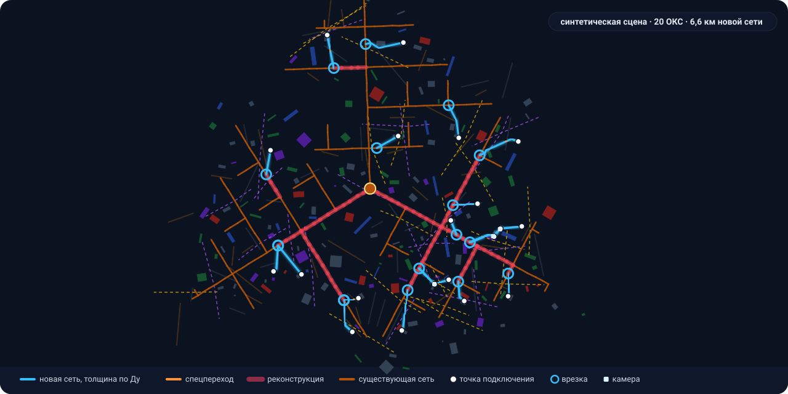
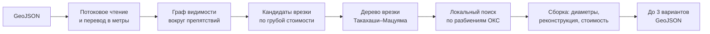
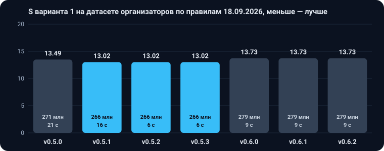

<div align="center">

# Трассировка тепловых сетей

**Сервис сам прокладывает трассы подключения новых зданий к тепловой сети Москвы: выбирает точки врезки, обходит препятствия, подбирает диаметры, считает реконструкцию и стоимость и отдаёт до трёх вариантов в одном GeoJSON.**

[](pom.xml)
[](pom.xml)
[](docker-compose.yml)
<br>
[](#-версии-и-динамика-качества)
[](#-версии-и-динамика-качества)
[](docs/testing/scenario-report.md)
[](tools/validator/heatcheck)

[Задача и статус](TASK.md) ·
[Быстрый старт](#-быстрый-старт) ·
[Как считает](#-как-считает) ·
[API](#-api) ·
[Версии](#-версии-и-динамика-качества) ·
[Проверки](#-как-проверяется-качество) ·
[Документация](#-документация)

<br>



<sub>Вариант 1 на синтетической сцене из генератора: голубым новая сеть, малиновым участки реконструкции, оранжевым существующая сеть. Датасет организаторов не показывается, картинка пересобирается командой <code>scripts/readme_assets.py</code>.</sub>

</div>

<br>

## 🧭 Что это

Решение кейса ДИТ Москвы на конкурсе «Лидеры цифровой трансформации» 2026. Инженер загружает один GeoJSON: существующая тепловая сеть с камерами и источником, точки подключения новых зданий и пространственные ограничения — здания, дороги, трамвайные пути, газопроводы, кабели, парки, вода. Сервис за один запуск строит сеть для всех зданий сразу и возвращает варианты с ранжированием по показателю S: чем меньше, тем лучше.

Правила кейса выписаны из документов организатора в [CONSTRAINTS.md](architecture/CONSTRAINTS.md), уточнения организаторов от 16.09.2026 — в его разделе 18. При расхождении прав этот файл, а над ним только сами документы в [docs/source/](docs/source/).

<table>
<tr>
<td width="33%" valign="top">

**🗺️ Трассы по правилам**<br>
Обход запретных зон с отступом по диаметру, переходы дорог под углом от 45°, отводы 45° и 90°, ветвление только в камерах и не больше трёх ответвлений из камеры.

</td>
<td width="33%" valign="top">

**💧 Гидравлика кейса**<br>
Расход по дереву, минимальный диаметр по пропускной способности, предельная длина цепочки, реконструкция существующей сети до источника.

</td>
<td width="33%" valign="top">

**💰 Стоимость и варианты**<br>
Участки, камеры, врезки, реконструкция, штрафы за неподключённые здания. До трёх содержательно разных вариантов с рангом по S.

</td>
</tr>
<tr>
<td valign="top">

**🎯 Детерминированность**<br>
Поиск ограничен числом сборок, а не временем: на ноутбуке и на стенде экспертов один и тот же вход даёт побайтно один и тот же выход.

</td>
<td valign="top">

**📦 Большие файлы**<br>
Вход читается потоком по одной фиче, задачи идут через очередь с фоновыми воркерами, результат пишется потоком.

</td>
<td valign="top">

**🔍 Независимая проверка**<br>
Валидатор на Python пересчитывает выход по 15 правилам кейса, 221 сценарий покрывает все 69 условий ТЗ.

</td>
</tr>
</table>

## 🚀 Быстрый старт

Нужен Docker с compose. Команда поднимает приложение и PostgreSQL:

```bash
make up
```

Отправить входной файл. Ответ содержит `id` задачи:

```bash
curl -s -X POST -H 'Content-Type: application/geo+json' \
  --data-binary @data/samples/small-1.geojson http://localhost:8080/api/v1/jobs
```

Проверить статус и забрать результат, когда задача в статусе `DONE`:

```bash
curl -s http://localhost:8080/api/v1/jobs/<id>
curl -s http://localhost:8080/api/v1/jobs/<id>/result -o result.geojson
```

Swagger UI: `http://localhost:8080/swagger-ui/index.html`.

<details>
<summary><b>Без Docker: из командной строки</b></summary>

<br>

Нужны JDK 11, Maven 3.9 и [uv](https://docs.astral.sh/uv/) для Python-инструментов.

```bash
source scripts/gates/env.sh
make cli IN=data/samples/small-1.geojson OUT=data/out/small-1.geojson
make validate IN=data/samples/small-1.geojson OUT=data/out/small-1.geojson
```

Карта результата для защиты открывается в браузере без сети:

```bash
make viz IN=data/samples/small-1.geojson OUT=data/out/small-1.geojson
```

Правила другого ресурса, например условный водопровод из `rules/examples/water-supply.json`, подставляются параметром `RULES=` или аргументом `--rules=` у jar.

Та же сборка есть для Gradle: `./gradlew bootJar`. Переменные окружения, сборка и тесты подробно — в [BACKEND.md](architecture/BACKEND.md).

</details>

## ⚙️ Как считает



1. **Граф.** Здания и запретные зоны раздуваются на отступ, узлы графа — их выпуклые вершины. Рёбра проверяются только касательные к зонам, таблицы кратчайших путей кэшируются.
2. **Врезки.** Для каждой группы близких зданий берутся ближайшие камеры и проекции на трубы, лучшие по стоимости с учётом реконструкции цепочки к источнику. Если точка врезки ближе 10 м к камере со свободным местом, врезка идёт в камеру.
3. **Дерево.** К дереву врезки по одному присоединяется здание с самым лёгким маршрутом; путь проверяется правилом поворотов и раскладывается по направлениям через 45°.
4. **Поиск.** Сливает, переносит и выделяет здания между врезками, меняет врезку и перезапускается от лучшего решения, пока не кончится бюджет в 300 сборок.
5. **Варианты.** До трёх лучших решений, различающихся врезками или разбиением, выдаются с рангами.

Подробно — в [ARCHITECTURE.md](architecture/ARCHITECTURE.md), причины решений — в [ADR-0001](docs/specs/backend-core/adr/0001-routing-approach.md) и [ADR-0002](docs/specs/backend-core/adr/0002-partition-local-search.md), границы применения — в конце [BACKEND.md](architecture/BACKEND.md).

## 📈 Версии и динамика качества

<div align="center">

</div>

<br>

> [!TIP]
> **Лучшая рабочая версия: v0.3.4.** Вернуться к ней: `git checkout v0.3.4`. Порядок выпуска версий и правила — в [CONTRIBUTING.md](CONTRIBUTING.md#версии).

Замер на датасете организаторов `data/real/dataset.geojson`: S и стоимость варианта 1 из `variant_summary`, время — стенные секунды расчёта через CLI. Машина: MacBook, 11 ядер, 18 ГБ, один процесс, `scripts/bench.sh`. На стенде экспертов время будет другим, S и стоимость с версии 0.3.0 те же.

| Версия | Дата | S | Стоимость, млн руб. | Время, с | Что изменилось |
|---|---|---|---|---|---|
| v0.3.4 | 17.09.2026 | 13,149 | 276,0 | 46 | общий кэш маршрутов с потолком 1 ГБ, чтение без дальних зданий и ограничений: на входе с 200 тыс. зданий куча 434 → 154 МБ и процессорное время 82 → 61 с; выход на датасете и в 221 сценарии тот же, что у 0.3.3, время датасета не мерили на свободной машине, процессорное время прежнее |
| v0.3.3 | 17.09.2026 | 13,149 | 276,0 | 46 | пространственный индекс препятствий: на входе с 200 тыс. зданий расчёт на треть быстрее; выход на датасете тот же, что у 0.3.2, время датасета не мерили на свободной машине, процессорное время прежнее |
| v0.3.2 | 17.09.2026 | 13,149 | 276,0 | 46 | подмена файла правил и пример водопровода, дополнительные критерии и причины неподключения в сводке API и файле CLI, офлайн-карта результата `make viz`; выход на датасете тот же, что у 0.3.1 |
| v0.3.1 | 16.09.2026 | 13,149 | 276,0 | 46 | надбавки к целям присоединения ветки (H-1), стенд `scripts/bench.sh`; выход на датасете тот же, что у 0.3.0 |
| v0.3.0 | 16.09.2026 | 13,149 | 276,0 | 51 | поиск детерминирован по бюджету 300 сборок, кэш таблиц Дейкстры, отсечение целей, перезапуск поиска от лучшего черновика |
| v0.2.0 | 16.09.2026 | 14,012 | 297,4 | 73 | протокол организаторов 16.09.2026: трассы по сетке 45° и коэффициент 1,5 за нестандартный угол, врезка на каждую ветку из камеры, `heat_load` справочный, деление спецучастка по коэффициенту, сборка Gradle |
| v0.1.0 | 16.09.2026 | 16,762 | 359,4 | 69 | граф видимости по касательным рёбрам, локальный поиск по разбиениям с пределом 60 с; S посчитан по правилам до протокола 16.09.2026 и с последующими версиями напрямую не сравнивается |

Какие идеи проверяли и что они дали — в [журнале гипотез](docs/research/hypotheses.md).

## 🔌 API

| Запрос | Что делает |
|---|---|
| `POST /api/v1/jobs` | принимает GeoJSON телом запроса, ставит задачу в очередь, отвечает `202` с `id` |
| `GET /api/v1/jobs` | список задач, новые первыми |
| `GET /api/v1/jobs/{id}` | статус `QUEUED`, `RUNNING`, `DONE` или `FAILED`, ошибки входа по объектам, после `DONE` сводки вариантов |
| `GET /api/v1/jobs/{id}/result` | выходной GeoJSON; `409`, пока задача не готова |
| `GET /api/v1/jobs/{id}/input` | исходный файл байт в байт |

Невалидный вход не считается: задача получает `FAILED` со списком проблем вида «объект, поле, что не так». Формат выхода по типам объектов — в разделе 13 [CONSTRAINTS.md](architecture/CONSTRAINTS.md). В сводке задачи у каждого варианта есть `criteria`: пересечённые объекты по типам, повороты, длина спецпереходов, надбавки и удельная стоимость; поля описаны в [BACKEND.md](architecture/BACKEND.md#дополнительные-критерии).

## ✅ Как проверяется качество

| Проверка | Команда | Что ловит |
|---|---|---|
| Юнит- и интеграционные тесты | `make test-java` | ошибки расчёта, API, чтения и записи |
| Валидатор выхода | `make validate IN=… OUT=…` | 15 правил кейса: топология, расход, диаметры, отступы, спецпереходы, стоимость, S |
| Сценарии S00–S14 | `make test-scenarios` | 221 сценарий на все 69 условий ТЗ, отчёт в [scenario-report.md](docs/testing/scenario-report.md) |
| Датасет организаторов | `make real` | расчёт реального района с проверкой валидатором |
| Стенд качества | `scripts/bench.sh <метка>` | S, статьи стоимости и время на датасете и трёх синтетических сценах |

## 📚 Документация

| Документ | Что в нём |
|---|---|
| [TASK.md](TASK.md) | задача хакатона, все требования заказчика, открытые вопросы и статус: что сделано и что осталось |
| [CONSTRAINTS.md](architecture/CONSTRAINTS.md) | правила кейса из ТЗ и уточнения организаторов |
| [ARCHITECTURE.md](architecture/ARCHITECTURE.md) | устройство сервиса и алгоритм по шагам |
| [BACKEND.md](architecture/BACKEND.md) | запуск, API, сборка, переменные окружения, границы применения |
| [interpretation.md](docs/interpretation.md) | как читаются спорные места правил, одинаково в Java и Python |
| [hypotheses.md](docs/research/hypotheses.md) | журнал гипотез улучшения: что проверили, что дало, что приняли |
| [load-limits.md](docs/load-limits.md) | задачи по проверке 3 ГБ, 50 пользователей и 16 ГБ памяти |
| [docs/README.md](docs/README.md) | индекс документов и пакетов спек |

<details>
<summary><b>Состав репозитория</b></summary>

<br>

| Путь | Что там |
|---|---|
| `architecture/` | правила кейса, архитектура, практика бекенда |
| `src/main/java/ru/lct/heatnet/` | сервис на Java 11 и Spring Boot |
| `src/test/java/` | юнит- и интеграционные тесты |
| `rules/rules.json` | все таблицы и коэффициенты кейса; Java и Python читают только этот файл |
| `tools/` | Python-инструменты одним uv-проектом: генератор, валидатор, сценарии |
| `tests/` | pytest-тесты Python-инструментов, как запускать — в [tests/README.md](tests/README.md) |
| `scripts/gates/` | скрипты приёмки задач |
| `docs/` | документы организатора, пакеты спек, отчёты ресёрча и тестов |
| `data/samples/` | небольшой синтетический набор для пробы; датасет организаторов в `data/real/`, наружу не отдаётся |
| `pom.xml`, `build.gradle` | сборка Maven, основная, и та же сборка Gradle через `./gradlew` |
| `docker-compose.yml`, `Dockerfile` | приложение и PostgreSQL в одном compose |

</details>

## 🤝 Как участвовать

Порядок чтения, правила для документов, версии и команды проверки — в [CONTRIBUTING.md](CONTRIBUTING.md), для агентов сверх этого — в [AGENTS.md](AGENTS.md). Одна задача — одна ветка от `main`. Новая версия получает строку в таблице «Версии» и тег `vX.Y.Z`.

<br>

<div align="center">
<sub>Лидеры цифровой трансформации 2026 · кейс Департамента информационных технологий Москвы</sub>
</div>
