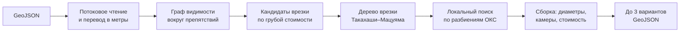
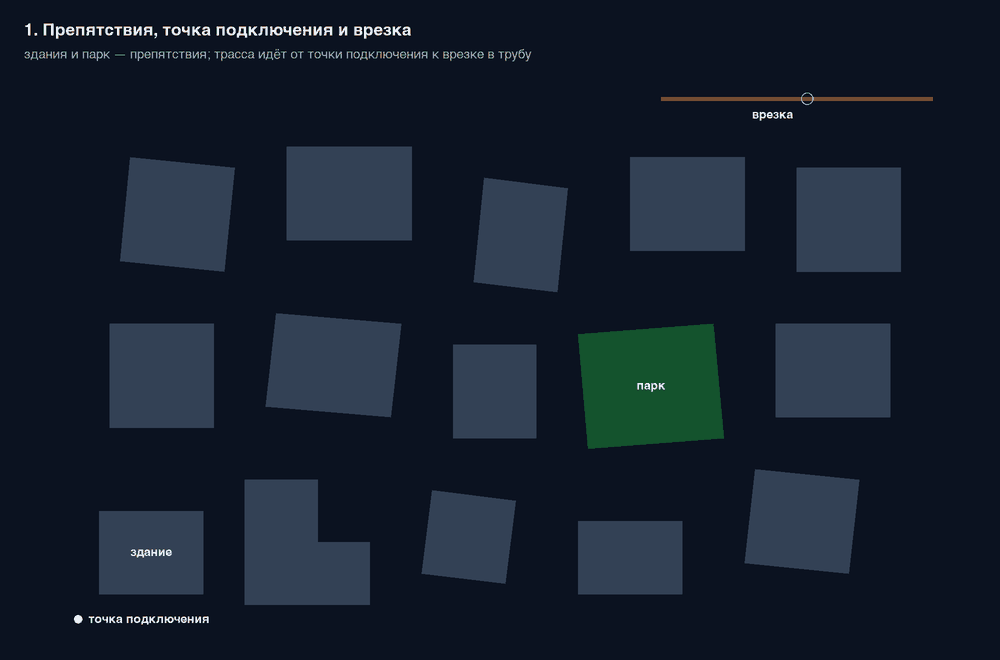
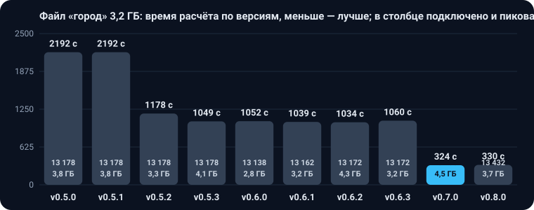

<div align="center">

# Трассировка тепловых сетей

**Сервис сам прокладывает трассы подключения новых зданий к тепловой сети Москвы: выбирает точки врезки, обходит препятствия, подбирает диаметры по расходу и длине, считает стоимость и показатель S и отдаёт до трёх вариантов в одном GeoJSON.**

[](pom.xml)
[](pom.xml)
[](docker-compose.yml)
<br>
[](#-версии-и-динамика-качества)
[](#-версии-и-динамика-качества)
[](tools/validator/check18.py)

[Задача и статус](TASK.md) ·
[Быстрый старт](#-быстрый-старт) ·
[Как считает](#-как-считает) ·
[API](#-api) ·
[Версии](#-версии-и-динамика-качества) ·
[Проверки](#-как-проверяется-качество) ·
[Документация](#-документация)

**Как запустить и проверить — [INSTRUCTION.md](INSTRUCTION.md)**

<br>


<sub>Вариант 1 на синтетической сцене из генератора: голубым новая сеть, оранжевым существующая сеть. Датасет организаторов не показывается, картинка пересобирается командой <code>scripts/readme_assets.py</code>.</sub>

</div>

<br>

## 🧭 Что это

Решение кейса ДИТ Москвы на конкурсе «Лидеры цифровой трансформации» 2026. Инженер загружает один GeoJSON: существующая тепловая сеть с камерами и источником, точки подключения новых зданий и пространственные ограничения — здания, дороги, трамвайные пути, газопроводы, кабели, парки, вода. Сервис за один запуск строит сеть для всех зданий сразу и возвращает варианты с ранжированием по показателю S: чем меньше, тем лучше.

Правила кейса выписаны из документов организатора в [CONSTRAINTS.md](architecture/CONSTRAINTS.md): уточнения от 16.09.2026 — в разделе 18, редакция технического приложения от 18.09.2026 — в [разделе 19](architecture/CONSTRAINTS.md#19-редакция-технического-приложения-от-18092026). По этой редакции реконструкции существующей сети и объекта `tie_in` нет.

<table>
<tr>
<td width="33%" valign="top">

**🗺️ Трассы по правилам**<br>
Обход зданий и запретных зон с отступом по диаметру, финальный прямой участок в своё здание, переходы дорог под углом от 45° одним прямым участком, повороты не круче 90°, ветвление только в камерах.

</td>
<td width="33%" valign="top">

**💧 Гидравлика кейса**<br>
Расход по дереву, минимальный диаметр по пропускной способности и предельной длине каждого пути, диаметр не убывает к врезке.

</td>
<td width="33%" valign="top">

**💰 Стоимость и варианты**<br>
Участки, новые камеры, врезки в существующие камеры, штрафы за неподключённые здания. До трёх содержательно разных вариантов с рангом по S.

</td>
</tr>
<tr>
<td valign="top">

**🎯 Детерминированность**<br>
Поиск ограничен числом сборок, а не временем: на ноутбуке и на стенде экспертов один и тот же вход даёт побайтно один и тот же выход.

</td>
<td valign="top">

**📦 Большие файлы**<br>
Вход читается потоком, разбор и геометрия идут пулом потоков; вход из тысяч зданий считается по районам параллельно. Синтетический город на 3,2 ГБ и 3,14 млн зданий считается около 5,5 минуты.

</td>
<td valign="top">

**🔍 Независимая проверка**<br>
Проверщик [check18](tools/validator/check18.py) на Python не использует код сервиса и проверяет выход по редакции правил от 18.09.2026: объекты и ссылки, повороты, отступы, диаметры, камеры, стоимость и сводку.

</td>
</tr>
</table>

## 🚀 Быстрый старт

Пошагово, со всеми способами запуска, проверкой результата и разбором ошибок — в [INSTRUCTION.md](INSTRUCTION.md). Коротко: нужен Docker с compose, для расчёта из командной строки ещё JDK 11 и [uv](https://docs.astral.sh/uv/).

Поднять приложение с PostgreSQL, отправить пример и забрать результат, когда статус задачи станет `DONE`:

```bash
make up
curl -s -X POST -H 'Content-Type: application/geo+json' \
  --data-binary @data/samples/small-1.geojson http://localhost:8080/api/v1/jobs
curl -s http://localhost:8080/api/v1/jobs/<id>
curl -s http://localhost:8080/api/v1/jobs/<id>/result -o result.geojson
```

Посчитать тот же файл без веба и базы и сразу проверить выход проверщиком `check18`:

```bash
make run IN=data/samples/small-1.geojson OUT=data/out/small-1.geojson
```

Swagger UI: `http://localhost:8080/swagger-ui/index.html`. Все команды `make` — в `make help`.

## ⚙️ Как считает



1. **Граф.** Здания, включая подключаемые, и запретные зоны раздуваются на отступ, узлы графа — их выпуклые вершины. Рёбра проверяются только касательные к зонам, отступ — по точному расстоянию до здания, повороты в Дейкстре не круче 90°, таблицы кратчайших путей кэшируются. Углы готовой трассы срезаются хордой, если хорда держит отступ. К точке внутри здания маршрут идёт от точки выхода на луче к ближайшей границе.
2. **Врезки.** Для каждой группы близких зданий берутся ближайшие камеры и проекции на трубы, лучшие по грубой стоимости. Если точка врезки ближе 10 м к камере со свободным местом, участок заканчивается в этой камере, иначе на трубе ставится новая камера.
3. **Дерево.** К дереву врезки по одному присоединяется здание с самым лёгким маршрутом; в узлах ветвления стоят камеры. Если ствол короче от врезки у его вершины или от первой камеры ветвления, врезка переносится туда.
4. **Поиск.** Сливает, переносит и выделяет здания между врезками, меняет врезку и перезапускается от лучшего решения, пока 100 сборок подряд не дадут улучшения или не кончится бюджет в 1000 сборок.
5. **Варианты.** До трёх лучших решений, различающихся врезками или разбиением, выдаются с рангами.

Шаг 1 в движении: зоны отступа, касательные рёбра, волна Дейкстры и раскладка пути по 45° на учебной сцене (`scripts/graph_gif.py`).



Если зданий с точками подключения больше 500, сервис считает вход по-городски. Точки у существующей сети подключаются прямыми участками к ближайшей камере или новой камере на трубе, без графа. Точки дальше 11 276 м от сети недостижимы: даже Ду 1400 не уложит такой путь в предельную длину. Остальные делятся на районы до 16 зданий, каждый район проходит те же шаги 1–5 параллельно с другими, от ближних к сети к дальним, пока не истечёт срок `heatnet.city.deadline` (5 минут). На синтетическом городе из 3,14 млн зданий подключаются 13 432, расчёт идёт 5,5 минуты при `-Xmx12g -XX:MaxNewSize=512m`. Замеры — в [performance.md](docs/performance.md).

Подробно — в [ARCHITECTURE.md](architecture/ARCHITECTURE.md), причины решений — в [ADR-0001](docs/adr/0001-routing-approach.md) и [ADR-0002](docs/adr/0002-partition-local-search.md), границы применения — в конце [BACKEND.md](architecture/BACKEND.md).

## 📈 Версии и динамика качества

<div align="center">

</div>

<br>

> [!TIP]
> **Лучшая рабочая версия: v0.8.1.** Вернуться к ней: `git checkout v0.8.1`. Порядок выпуска версий и правила — в [CONTRIBUTING.md](CONTRIBUTING.md#версии).

Замер на датасете организаторов `data/real/dataset.geojson`: S и стоимость варианта 1 из `variant_summary`, время — стенные секунды расчёта через CLI. Машина: MacBook, 11 ядер, 18 ГБ, один процесс. Отсчёт начат заново с версии 0.5.0: организаторы 18.09.2026 выпустили новую редакцию правил ([что изменилось](architecture/CONSTRAINTS.md#19-редакция-технического-приложения-от-18092026)), и прежние S несравнимы с нынешними — по старым правилам здание с точкой подключения было проходимым, а стоимость включала реконструкцию. Как менялось качество на сценах «густо» и городе — в [research.md](docs/research.md).

| Версия | Дата | S | Стоимость, млн руб. | Время, с | Что изменилось |
|---|---|---|---|---|---|
| v0.8.1 | 26.09.2026 | 13,230 | 270,0 | 4 | расчёт быстрее при побайтово том же выходе: перебор узлов графа для цели ограничен лучшим найденным весом, на шаге сборки дерева сравниваются только новые цели; датасет 3,65 с вместо 4,65, районы города в 1,2 раза быстрее; [отчёт](docs/performance.md) |
| v0.8.0 | 26.09.2026 | 13,230 | 270,0 | 5 | выход из здания не уходит на дальнюю сторону, когда ближняя открыта (п. 2.2): точка, у которой нет ветки от выхода у ближней стены, уходит из дерева и подключается отдельно; в v0.7.0 так вышла точка 4 датасета. Варианты 2 и 3 — 13,344 и 13,428 вместо 13,422 и 13,818, «густо», medium и 203 сценария без изменений. `check18` дополнительно проверяет ближнюю сторону здания, углы и полосы спецпроходов, пересечение сети вне врезки, касания новых участков и ограничения неизвестных типов; [отчёт](docs/performance.md) |
| v0.7.0 | 25.09.2026 | 12,866 | 264,6 | 5 | зоны отступа по точному расстоянию до здания вместо буфера с острыми углами, срезка углов трасс хордой, перенос врезки к вершине ствола и ствол заново от первой камеры ветвления, третий вариант от блоков второго, выход из здания у ближней стены по Ду участка; застой поиска 100 и бюджет 1000; «густо» 53,188 / 109,373 / 225,245 вместо 56,126 / 115,644 / 233,268, на 203 сценариях вариант 1 лучше в 27 и нигде не хуже; расчёт в 1,3–2 раза быстрее: сетка зон в графе, чтение байтовым сканером, прямые подключения и критерии города параллельно; [отчёт](docs/performance.md) |
| v0.6.3 | 23.09.2026 | 13,729 | 279,3 | 7 | повторная работа убрана без изменения выхода: проверка выхода из своего здания идёт после дешёвых проверок и запоминается, деревья черновика отсеиваются по рамкам, полоса трассы черновика строится один раз; бюджет поиска 600 вместо 300 — на «густо» 100 и 200 поиск останавливается сам и даёт S 115,644 и 233,268 вместо 116,151 и 234,161, «густо-200» считается 14 с вместо 27; [история поиска](docs/research.md) |
| v0.6.2 | 23.09.2026 | 13,729 | 279,3 | 9 | точный поиск маршрута для точки, которая иначе остаётся без сети: состояние «узел и откуда в него пришли» на широкой области, предел 100 тыс. состояний. Он находит путь, в который нужно войти с другой стороны, и заменил ограничение первого поворота из 0.6.1. Выход на датасете организаторов побайтово тот же; «густо-100» подключает все 100 точек вместо 99, стоимость ниже ещё на 61 млн, время 10 с вместо 8 |
| v0.6.1 | 23.09.2026 | 13,729 | 279,3 | 9 | точка, у которой не осталось ни одного варианта, подключается маршрутом вдоль финального прямого участка: раньше такую ветку выбрасывал поворот в точке выхода из здания круче 90°, и точка оставалась со штрафом от 100 млн. Выход на датасете организаторов побайтово тот же; «густо» 50/100/200 — подключено 50/99/200 вместо 50/98/199, стоимость сцен 100 и 200 ниже на 63 и 70 млн; город подключает на 24 точки больше за 1039 с |
| v0.6.0 | 22.09.2026 | 13,729 | 279,3 | 9 | правила п. 2.2 и 1.1 строго: финальный участок только от ближайшей точки контура (другая сторона лишь при чужой зоне или повторном входе в своё здание, перебор трёх сторон по S убран), участок не проходит сквозь другое крыло своего здания, `check18` считает такой проход нарушением; читатель принимает любую геометрию ограничения любого типа (дорога или река линией не роняют расчёт); S 13,019 → 13,729 — цена строгого чтения |
| v0.5.3 | 22.09.2026 | 13,019 | 265,6 | 6 | город без изменения результата: критерии считают «дальше досягаемости» один раз на все варианты и считают причины неподключения параллельно без перебора 3 млн ОКС на каждую, точки вне рамки сети не ищут кандидатов прямого подключения, расстояния до сети параллельно; город 1049 с вместо 1178 при тех же 13 178 подключённых; выход на датасете организаторов и «густо» побайтово тот же |
| v0.5.2 | 22.09.2026 | 13,019 | 265,6 | 6 | время без потери качества: кэш зон отступа при проверке дерева, деревья кандидатов врезки параллельно (выход побайтово тот же), город без зданий дальше 11,3 км от сети (память 3,8 → 3,3 ГБ), оба варианта города за один проход прямых подключений, коридор графа района, срок на районы 15 минут вместо 30 (город 1178 с вместо 2192 при тех же 13 178 подключённых); проверка гипотез T1–T8 — в [docs/research.md](docs/research.md) |
| v0.5.1 | 22.09.2026 | 13,019 | 265,6 | 16 | выход из здания через одну из трёх ближайших сторон, а не только через ближайшую (S 13,492 → 13,019, на сценах «густо» подключены все точки); варианты 2 и 3 добираются ходами от лучшего черновика, порог схожести трасс 0,9 (три варианта 13,019 / 13,026 / 13,043 вместо двух); проверка гипотез Q1–Q7 — в [docs/research.md](docs/research.md) |
| v0.5.0 | 22.09.2026 | 13,492 | 271,1 | 21 | правила технического приложения от 18.09.2026: все здания — препятствия с финальным прямым участком в своё, без реконструкции и объекта `tie_in`, врезка через камеру, ДУ постоянен между узлами смены расхода и по предельной длине каждого пути, повороты до 90° без надбавки, спецпроход одним прямым участком, новая сводка; город: прямые подключения точек у сети (13 178 вместо 952), точки дальше 11,3 км от сети недостижимы по предельной длине, дальние районы — до срока 30 минут |

<details>
<summary>История версий по прежним правилам</summary>

| Версия | Дата | S | Стоимость, млн руб. | Время, с | Что изменилось |
|---|---|---|---|---|---|
| v0.4.2 | 22.09.2026 | 12,596 | 260,0 | 8 | расчёт большого входа по районам: файл «город» на 3,2 ГБ считается за 2,5 минуты вместо недостижимого прежде конца; параллельное чтение, ускоренные точные проверки геометрии, исправлены вырожденные трассы у точек подключения вплотную к трубам; выход на датасете и сценах `medium` побайтно как у 0.4.1 |
| v0.4.1 | 18.09.2026 | 12,596 | 260,0 | 23 | ранний выход локального поиска после плато (`heatnet.search.stall=50`, потолок по-прежнему 300 сборок): выход на датасете побайтно как у 0.4.0, время CLI ~23 с вместо ~51 с на той же машине |
| v0.4.0 | 17.09.2026 | 12,596 | 260,0 | 51 | врезки выше реконструкции: кандидаты в объектах сети над реконструируемыми участками, пересадка лучших деревьев на них с сохранением рёбер, граф подмножества по диаметру его расхода (H-6); реконструкция на датасете 21,2 → 0 млн руб., сумма S стенда 307,1 → 287,4; время мерили при нагрузке от других процессов |
| v0.3.4 | 17.09.2026 | 13,149 | 276,0 | 46 | общий кэш маршрутов с потолком 1 ГБ, чтение без дальних зданий и ограничений: на входе с 200 тыс. зданий куча 434 → 154 МБ и процессорное время 82 → 61 с; выход на датасете и в 221 сценарии тот же, что у 0.3.3, время датасета не мерили на свободной машине, процессорное время прежнее |
| v0.3.3 | 17.09.2026 | 13,149 | 276,0 | 46 | пространственный индекс препятствий: на входе с 200 тыс. зданий расчёт на треть быстрее; выход на датасете тот же, что у 0.3.2, время датасета не мерили на свободной машине, процессорное время прежнее |
| v0.3.2 | 17.09.2026 | 13,149 | 276,0 | 46 | подмена файла правил и пример водопровода, дополнительные критерии и причины неподключения в сводке API и файле CLI, офлайн-карта результата `make viz`; выход на датасете тот же, что у 0.3.1 |
| v0.3.1 | 16.09.2026 | 13,149 | 276,0 | 46 | надбавки к целям присоединения ветки (H-1), стенд `scripts/bench.sh`; выход на датасете тот же, что у 0.3.0 |
| v0.3.0 | 16.09.2026 | 13,149 | 276,0 | 51 | поиск детерминирован по бюджету 300 сборок, кэш таблиц Дейкстры, отсечение целей, перезапуск поиска от лучшего черновика |
| v0.2.0 | 16.09.2026 | 14,012 | 297,4 | 73 | протокол организаторов 16.09.2026: трассы по сетке 45° и коэффициент 1,5 за нестандартный угол, врезка на каждую ветку из камеры, `heat_load` справочный, деление спецучастка по коэффициенту, сборка Gradle |
| v0.1.0 | 16.09.2026 | 16,762 | 359,4 | 69 | граф видимости по касательным рёбрам, локальный поиск по разбиениям с пределом 60 с; S посчитан по правилам до протокола 16.09.2026 и с последующими версиями напрямую не сравнивается |

</details>

### Город

Файл `data/synth/city-1.geojson`: 3,2 ГБ, 3 143 825 точек подключения; в репозитории его нет. Считается через CLI при `-Xmx12g -XX:MaxNewSize=512m`, время — стенные секунды, память — пиковый RSS. 3 079 776 точек лежат дальше 11 276 м от сети и недостижимы при любом Ду, поэтому подключено 13 178 в версиях до 0.6.0, 13 138 в 0.6.0, 13 162 в 0.6.1, 13 172 в 0.6.2 и 13 438 в 0.7.0.

<div align="center">

</div>

| Версия | Подключено | S варианта 1 | Время, с | Память, ГБ | Что изменилось |
|---|---|---|---|---|---|
| v0.8.1 | 13 432 | 9 640 771 | 326 | 3,5 | районы в 1,2 раза быстрее: до срока 300 с начато 2092 района вместо 1888, выход тот же |
| v0.8.0 | 13 432 | 9 640 771 | 330 | 3,7 | выход с дальней стороны здания при открытой ближней запрещён, 6 точек остались без сети |
| v0.7.0 | 13 438 | 9 640 776 | 324 | 4,5 | районы в 3–7 раз быстрее, срок на районы 5 минут вместо 15 при том же наборе подключений; точки у трубы внутри своего здания подключаются врезкой со сдвигом вдоль трубы; по сводке подключено на 273 ОКС больше, чем в v0.6.3 (13 165) |
| v0.6.3 | 13 172 | 9 641 636 | 1060 | 3,2 | результат тот же; время при чужой загрузке машины до 60 |
| v0.6.2 | 13 172 | 9 641 636 | 1034 | 4,3 | точный поиск в запасном ходе: ещё 10 подключённых точек |
| v0.6.1 | 13 162 | 9 641 649 | 1039 | 3,2 | точки, отбракованные поворотом в точке выхода, подключаются маршрутом вдоль финального участка |
| v0.6.0 | 13 138 | 9 641 511 | 1052 | 2,8 | финальный участок только от ближайшей стороны и без прохода сквозь своё здание: 40 точек у П-образных зданий остались без допустимого прямого участка |
| v0.5.3 | 13 178 | 9 641 829 | 1049 | 4,1 | критерии без 9,4 млн запросов к сети, причины параллельно, прямые подключения без кандидатов у точек вне рамки сети, расстояния до сети параллельно |
| v0.5.2 | 13 178 | 9 641 829 | 1178 | 3,3 | здания читаются только в досягаемости сети, оба варианта прямых подключений за один проход, коридор графа района, срок на районы 15 минут вместо 30 |
| v0.5.1 | 13 178 | 9 641 367 | 2192 | 3,8 | городской режим не менялся, числа v0.5.0 |
| v0.5.0 | 13 178 | 9 641 367 | 2192 | 3,8 | правила 18.09: прямые подключения точек у сети, точки дальше 11,3 км недостижимы, районы до срока 30 минут |

Какие идеи проверяли и что они дали — в [research.md](docs/research.md).

## 🔌 API

| Запрос | Что делает |
|---|---|
| `POST /api/v1/jobs` | принимает GeoJSON телом запроса, ставит задачу в очередь, отвечает `202` с `id` |
| `GET /api/v1/jobs` | список задач, новые первыми |
| `GET /api/v1/jobs/{id}` | статус `QUEUED`, `RUNNING`, `DONE` или `FAILED`, ошибки входа по объектам, после `DONE` сводки вариантов |
| `GET /api/v1/jobs/{id}/result` | выходной GeoJSON; `409`, пока задача не готова |
| `GET /api/v1/jobs/{id}/input` | исходный файл байт в байт |

Невалидный вход не считается: задача получает `FAILED` со списком проблем вида «объект, поле, что не так». Формат выхода по типам объектов — в разделе 13 [CONSTRAINTS.md](architecture/CONSTRAINTS.md). В сводке задачи у каждого варианта есть `criteria`: пересечённые объекты по типам, повороты, длина спецпереходов, надбавки и удельная стоимость; поля описаны в [BACKEND.md](architecture/BACKEND.md#дополнительные-критерии).

## ✅ Как проверяется качество

| Проверка | Команда | Что ловит |
|---|---|---|
| Юнит-тесты | `make test-unit` | ошибки расчёта, чтения и записи; Docker не нужен |
| Юнит- и интеграционные тесты | `make test-java` (`mvn -B verify`) | то же и API с PostgreSQL; нужен Docker |
| Проверщик выхода | `make validate IN=… OUT=…` | нарушения редакции правил от 18.09.2026: состав объектов и ссылки, повороты до 90°, отступы, диаметры, камеры, стоимость, сводка. Проверщик [check18.py](tools/validator/check18.py) не использует код сервиса |
| Датасет организаторов | `make real` | расчёт `data/real/dataset.geojson` и проверка `check18`; датасет в репозитории не лежит, его кладут сами |
| Датасеты организаторов целиком | `scripts/check.sh organizers` | оба файла `data/real/dataset.geojson` и `data/real/dataset-corrected.geojson` считаются, все точки подключены, `check18` без нарушений |
| Сцены «густо» | `scripts/check.sh dense` | сцены на 50, 100 и 200 точек считаются и проходят `check18`; входов `data/synth/dense-50.geojson`, `dense-100` и `dense-200` в репозитории нет |
| Город | `scripts/check.sh city` | `data/synth/city-1.geojson` считается целиком при куче 12 ГБ не дольше часа, срез выхода проходит `check18`; входа в репозитории нет |
| Стенд качества | `scripts/bench.sh <метка>` | S, статьи стоимости и время на датасете организаторов и трёх сценах `medium`, которые генерируются при первом запуске |

Прежние сценарии S00–S14 и валидатор проверяли правила до 18.09.2026 и из репозитория убраны. Выход проверяет только `check18`.

## 📚 Документация

| Документ | Что в нём |
|---|---|
| [INSTRUCTION.md](INSTRUCTION.md) | как запустить сервис тремя способами, проверить результат, посчитать большой файл и что делать, если не работает |
| [TASK.md](TASK.md) | задача хакатона, требования заказчика, открытые вопросы и статус |
| [CONSTRAINTS.md](architecture/CONSTRAINTS.md) | правила кейса из документов организатора, уточнения от 16.09.2026 и редакция от 18.09.2026 |
| [ARCHITECTURE.md](architecture/ARCHITECTURE.md) | устройство сервиса и алгоритм по шагам |
| [BACKEND.md](architecture/BACKEND.md) | API, критерии, сборка, переменные окружения, границы применения |
| [interpretation.md](docs/interpretation.md) | как читаются спорные места правил |
| [research.md](docs/research.md) | как искали алгоритм: как мерили, хронология версий, что сработало и что нет, город, открытые направления |
| [performance.md](docs/performance.md) | замеры v0.8.1 против v0.8.0, v0.8.0 против v0.7.0 и v0.7.0 против v0.6.3: время и S на датасетах организаторов, сценах «густо» и городе |
| [ADR-0001](docs/adr/0001-routing-approach.md) | почему трассы строятся по графу видимости с эвристикой Штейнера |
| [ADR-0002](docs/adr/0002-partition-local-search.md) | почему локальный поиск идёт по разбиениям ОКС |

<details>
<summary><b>Состав репозитория</b></summary>

<br>

| Путь | Что там |
|---|---|
| `architecture/` | правила кейса, архитектура, практика бекенда |
| `src/main/java/ru/lct/heatnet/` | сервис на Java 11 и Spring Boot |
| `src/test/java/` | юнит- и интеграционные тесты |
| `rules/rules.json` | все таблицы и коэффициенты кейса; Java и проверщик читают только этот файл. Пример правил другого ресурса — `rules/examples/water-supply.json` |
| `tools/` | Python-инструменты одним uv-проектом: генератор синтетики `synth/heatsynth` и проверщик `validator/check18.py` |
| `scripts/` | `env.sh` подставляет JDK 11 и compose, `check.sh` и `bench.sh` проверяют качество, `visualize.py` строит офлайн-карту результата, остальные скрипты пересобирают картинки документации |
| `docs/` | история поиска алгоритма, отчёт о замерах, ADR, чтение спорных мест правил, картинки |
| `data/samples/` | небольшой синтетический вход для пробы; остальное в `data/` в git не попадает, датасет организаторов кладут в `data/real/dataset.geojson` |
| `pom.xml`, `build.gradle` | сборка Maven, основная, и та же сборка Gradle через `./gradlew` |
| `docker-compose.yml`, `Dockerfile` | приложение и PostgreSQL в одном compose |

</details>

## 🤝 Как участвовать

Порядок чтения, правила для документов, версии и команды проверки — в [CONTRIBUTING.md](CONTRIBUTING.md). Одна задача — одна ветка от `main`. Новая версия получает строку в таблице «Версии» и тег `vX.Y.Z`.

<br>

<div align="center">
<sub>Лидеры цифровой трансформации 2026 · кейс Департамента информационных технологий Москвы</sub>
</div>
