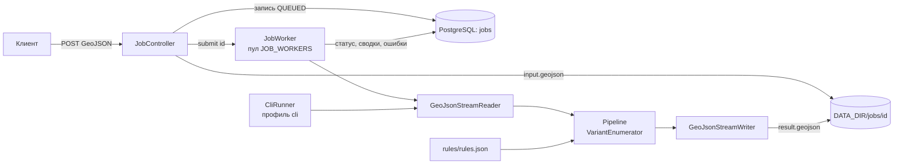
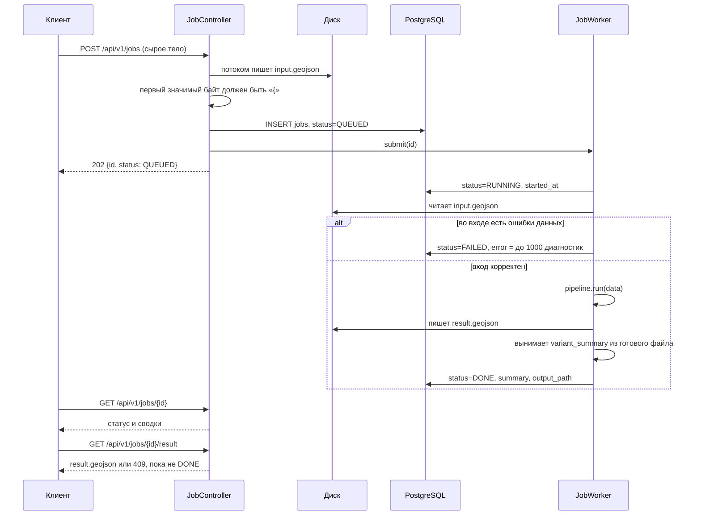
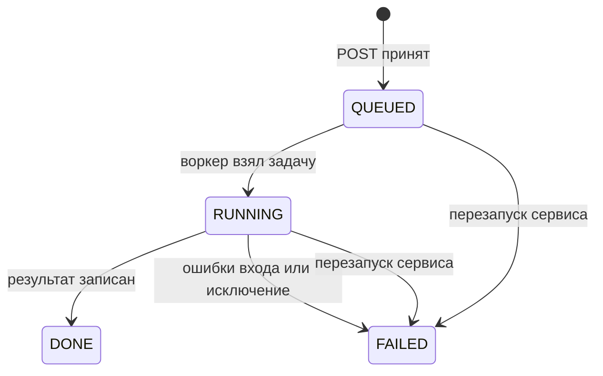
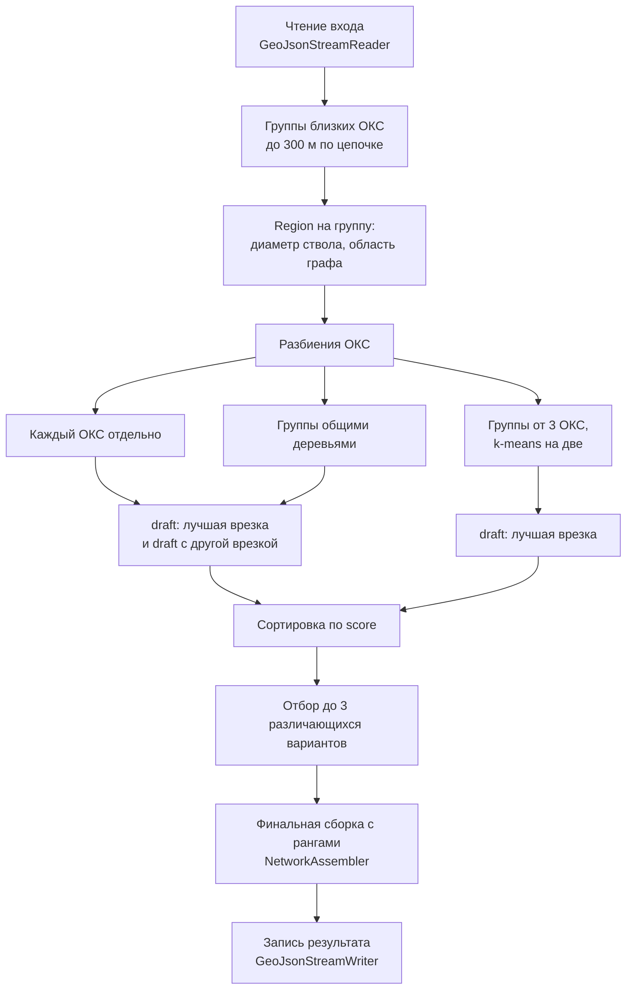
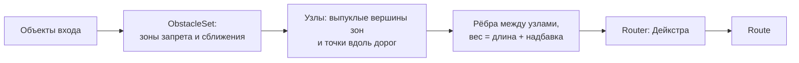
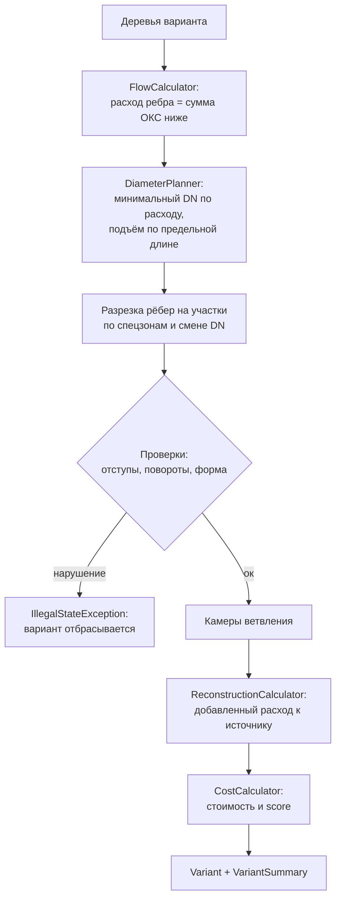
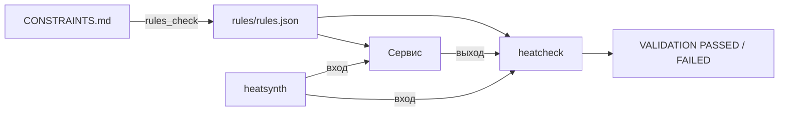

# Архитектура бекенда

Документ описывает, как устроен сервис трассировки тепловых сетей: из каких частей он состоит, как задача проходит через API, и что происходит внутри расчёта. Запуск, переменные окружения и примеры запросов описаны в [BACKEND.md](BACKEND.md). Правила кейса лежат в [CONSTRAINTS.md](CONSTRAINTS.md), причины выбора алгоритма — в [ADR-0001](../docs/specs/backend-core/adr/0001-routing-approach.md).

## Общая схема

Сервис — одно приложение на Spring Boot. Расчёт не зависит от веба и базы: одно и то же ядро `Pipeline` вызывают и REST-воркер, и CLI.

| Пакет | Роль |
|---|---|
| `api` | REST, сущность задачи, воркер и обработчик ошибок |
| `cli` | запуск расчёта из командной строки, профиль `cli` без веба и базы |
| `core` | интерфейс `Pipeline` и его реализация, которая создаёт `VariantEnumerator` на каждый запуск |
| `io` | потоковое чтение и запись GeoJSON, перевод EPSG:4326 ↔ EPSG:32637 |
| `model` | входные объекты и объекты результата |
| `rules` | загрузка `rules/rules.json`: диаметры, стоимости, отступы, коэффициенты |
| `graph` | зоны препятствий, visibility graph (граф прямой видимости между вершинами препятствий), кратчайший путь |
| `plan` | кандидаты врезки, деревья, варианты, сборка сети |
| `calc` | расходы, диаметры, реконструкция, стоимость, ранжирование |

## Жизненный цикл задачи

Несколько деталей, которые влияют на поведение:

- Тело запроса пишется на диск как есть, без multipart. Так файл до 3 ГБ не держится в памяти и не упирается в лимиты Tomcat. Если тело пустое или не JSON-объект, каталог задачи удаляется и клиент получает `400`.
- Запись задачи коммитится до `submit`, поэтому воркер всегда видит её в базе.
- Каждая смена статуса сохраняется отдельной короткой транзакцией. Расчёт идёт вне транзакции.
- Воркер ловит не только исключения, но и `OutOfMemoryError` и `StackOverflowError`. Иначе задача навсегда осталась бы в `RUNNING`.
- Сводки для API воркер берёт из уже записанного `result.geojson`, а не из объектов в памяти. Числа в API и в файле совпадают до знака, `12.30` не превращается в `12.3`.
- При старте приложения все задачи в `QUEUED` и `RUNNING` помечаются `FAILED` с сообщением «Задача прервана перезапуском сервиса». Очередь в памяти после рестарта не восстанавливается.

### Хранение

Таблица `jobs` создаётся из `src/main/resources/schema.sql` при каждом старте (`CREATE TABLE IF NOT EXISTS`), Hibernate схему не трогает.

| Поле | Что хранит |
|---|---|
| `id` | UUID задачи, он же имя каталога `DATA_DIR/jobs/<id>/` |
| `status` | `QUEUED`, `RUNNING`, `DONE`, `FAILED` |
| `created_at`, `started_at`, `finished_at` | времена этапов |
| `error` | `jsonb`: `{"message", "errors": [{featureId, field, problem}]}` |
| `summary` | `jsonb`: массив `variant_summary` из результата |
| `input_path`, `output_path` | пути к `input.geojson` и `result.geojson` |

Сами GeoJSON в базе не лежат, только пути к файлам.

## Расчёт

`PipelineImpl` загружает `rules.json` один раз на процесс и на каждый вызов создаёт новый `VariantEnumerator`. Всё состояние расчёта живёт в этом объекте, поэтому параллельные задачи друг другу не мешают.

### 1. Чтение входа

`GeoJsonStreamReader` идёт по файлу потоком и держит в памяти одну фичу за раз. Геометрию он сразу переводит в EPSG:32637 (UTM 37N), где все длины и отступы считаются в метрах. Ошибки данных — нет обязательного поля, не тот тип, повтор `id`, ссылка в пустоту — копятся как `Diagnostic`. Если хоть одна есть, расчёт не запускается.

Читатель принимает и формат раздела 12 CONSTRAINTS.md, и формат датасета организаторов. В датасете нет `upstream_object_id`, текущего расхода сети, диаметра камер и `oks_future`, а здания заданы ограничениями `oks`. Недостающее читатель выводит после прохода по файлу: направление сети обходом от источника по стыкам концов, диаметр камеры по примыкающим участкам, расход по диаметру, перспективный ОКС по точке подключения внутри здания. Правила вывода записаны в [docs/interpretation.md](../docs/interpretation.md), валидатор выводит то же самое независимо.

### 2. Группы и области

ОКС, чьи точки подключения ближе 300 м друг к другу (транзитивно), объединяются в группу. На каждую группу создаётся `Region`:

- диаметр ствола — по суммарному расходу группы плюс одна ступень запаса, чтобы отступы были верны и для участков, которые позже поднимут по предельной длине;
- область графа — прямоугольник вокруг точек подключения и кандидатов врезки с запасом 150 м, и широкая область с запасом 600 м для повторной попытки;
- кэш построенных деревьев по подмножествам ОКС и кэш `Router` по паре «диаметр, область».

Граф строится за время, квадратичное по числу узлов, поэтому он строится на область группы, а не на весь город.

### 3. Кандидаты врезки

`TieInFinder` для каждой точки берёт три ближайшие камеры и перпендикулярные проекции на три ближайших участка сети. Проекция превращается во врезку в камеру, если камера не дальше `max_dist_m` и после подключения у неё будет не больше `max_segments` участков. Иначе врезка идёт в трубу, и в точке врезки ставится новая камера.

Если все ближайшие кандидаты дают одну и ту же врезку, а вариантов нужно минимум два, `TieInFinder.along` ищет врезку в той же сети дальше 20 м от лучшей.

### 4. Маршрут: visibility graph

`ObstacleSet` раздувает запрещённые объекты (существующие ОКС, парки, социальные объекты, запретные территории, вода) на минимальный отступ плюс половину ширины пары труб. Узлы графа — выпуклые наружу вершины этих зон и точки вдоль сторон дорог, не лежащие ни в одной зоне. У выпуклой вершины запоминаются соседи по кольцу зоны: ребро проверяется, только если касается зоны в обоих концах, то есть не уходит внутрь угла. В кратчайшем пути других рёбер не бывает, а геометрических проверок становится в несколько раз меньше.

Ребро между двумя узлами допустимо, если:

- не заходит в запрещённую зону;
- дорогу и трамвайные пути пересекает под углом не меньше 45°;
- газопровод, кабель и существующую теплосеть либо пересекает, либо проходит от них не ближе отступа.

Вес ребра — длина плюс надбавка `(Kспец − 1) × длина специального прохода`. `Router` строит граф один раз в конструкторе и хранит его массивами смежности. Точки запроса в граф не добавляются: веса от точки до всех узлов считаются отдельно и кэшируются по координате, потому что одна точка подключения и одни и те же цели дерева запрашиваются десятки раз за построение. Таблица Дейкстры от точки запроса тоже кэшируется по координате и набору пропускаемых объектов: локальный поиск запрашивает одни и те же точки подключения сотни раз, на датасете организаторов из кэша берётся 99 % таблиц. Цели дерева, наоборот, меняются с каждым черновиком, поэтому веса от цели до узлов считаются лениво и только там, где нижняя оценка (по графу до узла плюс по прямой до цели) бьёт уже найденный вес; цель, до которой расстояние по прямой не меньше лучшего веса, не проверяется вовсе. Это сокращает поиск в два с лишним раза при побайтно том же результате. Дейкстра идёт от виртуального источника по массивам, цель выбирается по сумме расстояния до узла и веса от узла до цели. Если на пути остаётся излом меньше 3°, а убрать вершину нельзя, вершина сдвигается от хорды шагами 0,5–8 м, пока излом не станет допустимым. Затем путь приводится к направлениям сетки через 45° (протокол 16.09.2026, п. 9): сетка повёрнута по самому длинному отрезку пути, поэтому прямая трасса и изломы, уже кратные 45°, не меняются. Каждый невыровненный отрезок раскладывается на два по соседним направлениям сетки в одном из двух порядков; чтобы новые отрезки прошли мимо зон, соседняя вершина может сдвинуться вдоль своего отрезка на фиксированные шаги или ровно до выравнивания. Вариант принимается, если новые отрезки допустимы, не короче метра, не режут остальной путь и не идут по трубе врезки; из вариантов берётся тот, где меньше нестандартных изломов, потом поворотов, потом веса. Где варианта нет, излом остаётся, и участок стоит в полтора раза дороже.

### 5. Дерево одной врезки

`TreeBuilder` растит дерево от врезки эвристикой Такахаши–Мацуямы: на каждом шаге присоединяется ОКС с самым лёгким маршрутом до уже построенного дерева. Маршрут обрезается в первой точке касания дерева, там ставится камера ветвления. Если у камеры нет свободного места (не больше трёх ответвлений), ответвление переносится на соседнюю точку ствола. Путь от врезки через ствол к новому ОКС проверяется правилом поворотов (`TurnRule`, не больше `3k + 6` по `rules.json`); если он нарушен, маршрут ищется к следующей по весу цели, до восьми попыток. ОКС, до которых маршрута нет, остаются в `tree.unconnected`.

Для одиночного ОКС без маршрута есть две повторные попытки: с диаметром по расходу самого ОКС вместо диаметра ствола, затем на широкой области.

### 6. Варианты

`VariantEnumerator.run` собирает черновики (`Draft`) по разбиениям ОКС:

| Разбиение | С лучшей врезкой | С другой врезкой |
|---|---|---|
| каждый ОКС отдельно | да | да |
| группы близких ОКС | да, если есть группа больше одного ОКС | да |
| группы от трёх ОКС, разбитые k-means на две | да, если такие группы есть | нет |

Внутри черновика подмножества идут по убыванию размера. Каждое берёт лучшее дерево, которое не пересекается с уже принятыми. Деревья подмножества строятся не на всех кандидатах врезки, а на шести лучших по грубой оценке: прямые от точек подключения по цене трубы, реконструкция цепочки к источнику от расхода подмножества и новая камера, если врезка в трубу. Если все деревья пересекаются, `merged` пробует снять мешающее дерево той же группы и построить одно общее. ОКС, которые не вошли в общее дерево, подключаются отдельными врезками, а без маршрута уходят в неподключённые. Черновик, который не собирается `NetworkAssembler`, отбрасывается.

От лучшего черновика идёт локальный поиск по разбиениям ОКС (`search`). Ходы: слить два ближайших блока, перенести ОКС в соседний блок, выделить ОКС в свой блок, разбить блок k-means на две части, взять для блока дерево с другой врезкой. Каждый ход — новый черновик той же процедурой. Спуск принимает первое улучшение; из локального оптимума он шагает на наименее плохого ещё не посещённого соседа, если тот хуже текущего не больше чем на 0,5 S, и спускается снова. Когда и такого соседа нет, работает приём walk: спуск перезапускается от лучшего найденного черновика по его наименее плохому непосещённому соседу уже без порога. Возвращается лучший найденный черновик. Поиск ограничен только числом сборок (`heatnet.search.budget`, 300), предела по стенным часам нет, поэтому результат на любой машине один и тот же. На датасете организаторов 300 сборок дают S 13,15 против 14,01 у 150, а 600 ничего не добавляют. Выигрыш дают слияния: одна врезка и одна реконструкция цепочки вместо нескольких.

Черновики сортируются по score. Вариант берётся, если он отличается от уже выбранных врезками или разбиением ОКС и не совпадает с ними по трассе: больше 80% длины меньшего в полосе 1 м от другого считается совпадением. Если так набирается меньше двух вариантов, отбор повторяется без проверки трассы. Выбранные до трёх вариантов собираются заново уже с рангами 1, 2, 3.

### 7. Сборка сети

`NetworkAssembler` превращает деревья варианта в объекты результата. Деревья с общей точкой врезки собираются в один узел; при врезке в существующую камеру каждое ребро из неё получает свою запись `tie_in` и свою стоимость врезки (протокол 16.09.2026, п. 8), при врезке в трубу запись одна, а ветвится новая камера.

- **Расходы.** `FlowCalculator` обходит дерево от листьев к корню: расход ребра равен сумме расходов ОКС ниже по дереву.
- **Диаметры.** `DiameterPlanner` ставит минимальный диаметр по пропускной способности. Если цепочка одного диаметра длиннее предельной длины, часть поднимается на ступень.
- **Проверки.** Сборка проверяет отступы от объектов специального прохода, число поворотов на пути от врезки до ОКС (не больше `3k + 6`) и форму участков. Нарушение бросает исключение, и вариант не выдаётся.
- **Реконструкция.** `ReconstructionCalculator` прокидывает добавленный расход каждой врезки по цепочке `upstream_object_id` к источнику. Части существующих участков, которым с новым расходом нужен больший диаметр, выдаются как реконструкция. Отдельно считается реконструкция камер врезки.
- **Стоимость.** `CostCalculator` складывает стоимость новых участков (`длина × цена за метр DN × Kспец`), камер, врезок, реконструкции участков и камер и штраф за неподключённые ОКС. Все суммы округляются до копеек. `score` считается по формуле из раздела 10 CONSTRAINTS.md и округляется до трёх знаков, меньше — лучше.

### 8. Запись результата

`GeoJsonStreamWriter` переводит геометрию обратно в EPSG:4326 и пишет результат потоком. В файле лежат объекты всех вариантов: новые участки, врезки, камеры, технические узлы, реконструкция и `variant_summary` на каждый вариант. Глубины `depth_start` и `depth_end` всегда `null`: расчёт идёт только в плане.

## Правила и проверка

Все таблицы и коэффициенты кейса лежат в `rules/rules.json`. Java-сервис и Python-инструменты читают только этот файл, поэтому числа в коде не дублируются.

Валидатор `tools/validator/heatcheck` не использует код сервиса и проверяет выход по 15 правилам разделов 5–13 CONSTRAINTS.md. Часть допусков в сборке подобрана под то, как считает валидатор: узлы ближе 0,05 м считаются одним узлом, специальная зона расширяется на 0,05 м. Такие места помечены комментариями в `NetworkAssembler` и `TieInFinder`.

Ограничения решения — эвристика без гарантии минимума, 2D, проверка только на синтетике — перечислены в разделе «Границы применения» [BACKEND.md](BACKEND.md).
