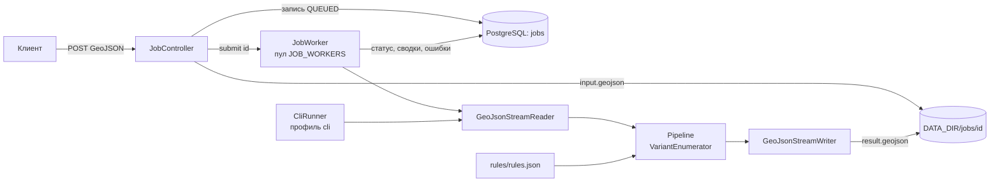
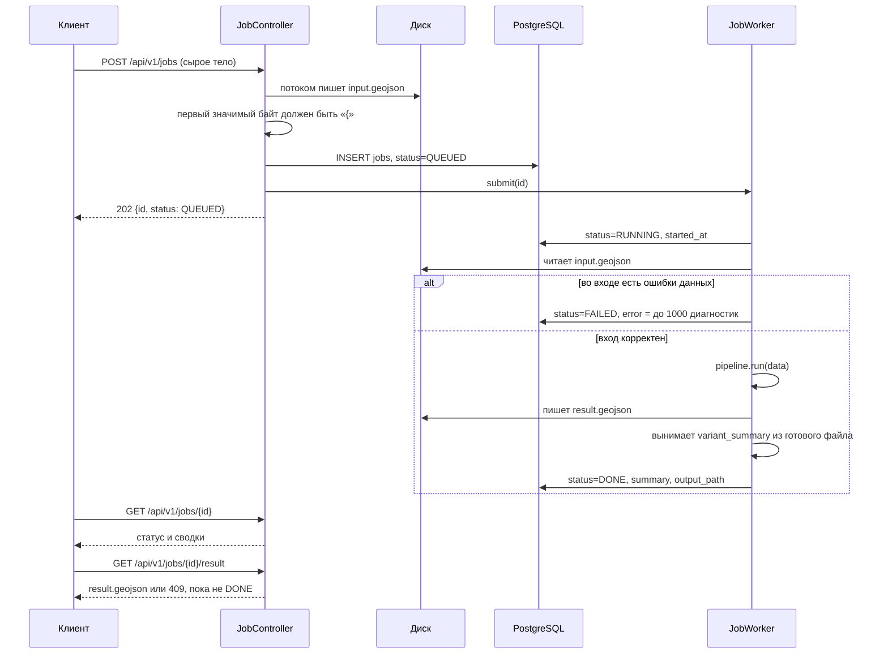
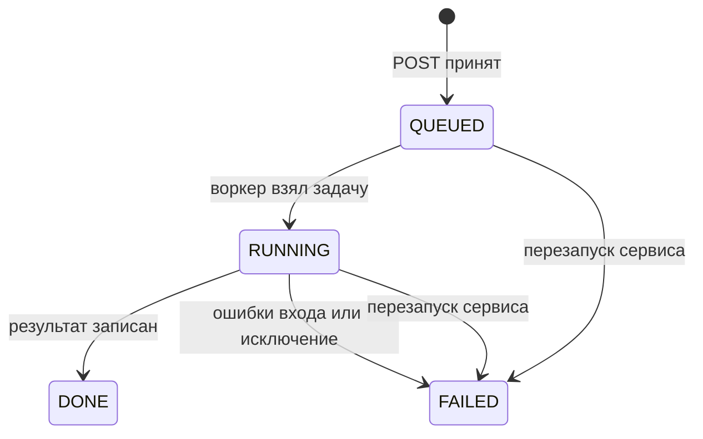
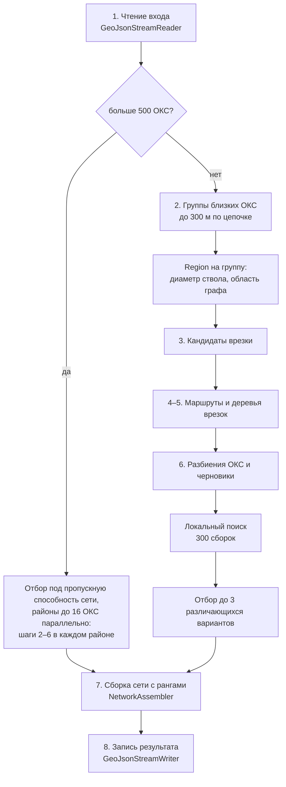
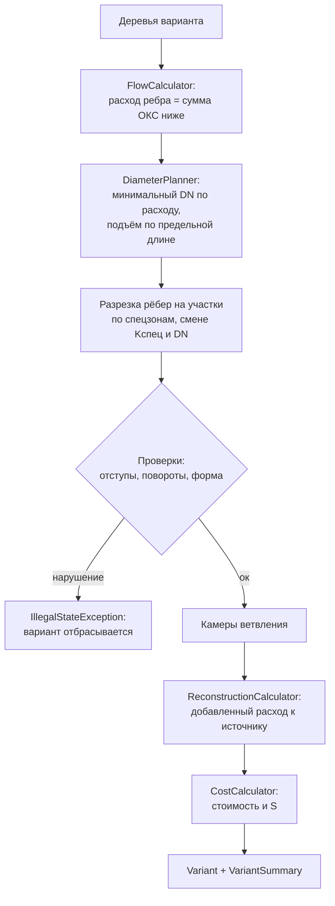
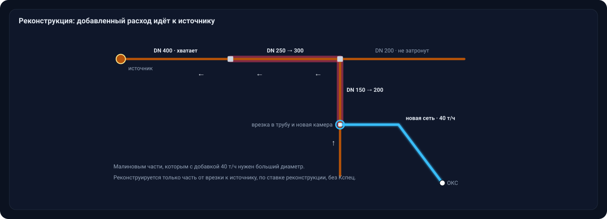
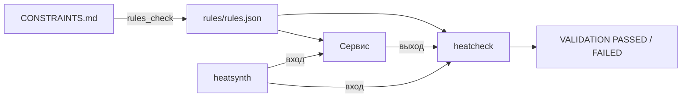

# Архитектура сервиса

**Из каких частей состоит сервис трассировки, как задача проходит через API и что происходит внутри расчёта — от чтения GeoJSON до готовых вариантов.**

[Общая схема](#общая-схема) ·
[Жизненный цикл задачи](#жизненный-цикл-задачи) ·
[Расчёт по шагам](#расчёт-по-шагам) ·
[Граф и маршрут](#4-маршрут-граф-видимости) ·
[Дерево](#5-дерево-одной-врезки) ·
[Варианты](#6-варианты-и-локальный-поиск) ·
[Большой вход](#большой-вход-расчёт-по-районам) ·
[Сборка](#7-сборка-сети) ·
[Проверка](#правила-и-проверка)

> [!NOTE]
> Запуск, переменные окружения и примеры запросов — в [BACKEND.md](BACKEND.md). Правила кейса — в [CONSTRAINTS.md](CONSTRAINTS.md). Почему выбран такой алгоритм — в [ADR-0001](../docs/specs/backend-core/adr/0001-routing-approach.md) и [ADR-0002](../docs/specs/backend-core/adr/0002-partition-local-search.md).

## Общая схема

Сервис — одно приложение на Spring Boot. Расчёт не зависит от веба и базы: одно и то же ядро `Pipeline` вызывают и REST-воркер, и CLI.

| Пакет | Роль |
|---|---|
| `api` | REST, сущность задачи, воркер и обработчик ошибок |
| `cli` | запуск расчёта из командной строки, профиль `cli` без веба и базы |
| `core` | интерфейс `Pipeline` и его реализация, которая создаёт `VariantEnumerator` на каждый запуск |
| `io` | потоковое чтение и запись GeoJSON, перевод EPSG:4326 ↔ EPSG:32637 |
| `model` | входные объекты и объекты результата |
| `rules` | загрузка `rules/rules.json`: диаметры, стоимости, отступы, коэффициенты |
| `graph` | зоны препятствий, граф видимости между вершинами зон, кратчайший путь |
| `plan` | кандидаты врезки, деревья, варианты, сборка сети |
| `calc` | расходы, диаметры, реконструкция, стоимость, ранжирование |

## Жизненный цикл задачи

Детали, которые влияют на поведение:

| Решение | Зачем |
|---|---|
| Тело запроса пишется на диск как есть, без multipart | файл до 3 ГБ не держится в памяти и не упирается в лимиты Tomcat; пустое тело или не JSON-объект удаляют каталог задачи и дают `400` |
| Запись задачи коммитится до `submit` | воркер всегда видит задачу в базе |
| Каждая смена статуса — отдельная короткая транзакция | расчёт идёт вне транзакции |
| Воркер ловит `OutOfMemoryError` и `StackOverflowError` | иначе задача навсегда осталась бы в `RUNNING` |
| Сводки для API берутся из записанного `result.geojson` | числа в API и в файле совпадают до знака, `12.30` не превращается в `12.3` |
| При старте все `QUEUED` и `RUNNING` становятся `FAILED` с сообщением «Задача прервана перезапуском сервиса» | очередь в памяти после рестарта не восстанавливается |

<b>Хранение задач в PostgreSQL</b>

 

Таблица `jobs` создаётся из `src/main/resources/schema.sql` при каждом старте (`CREATE TABLE IF NOT EXISTS`), Hibernate схему не трогает. Сами GeoJSON в базе не лежат, только пути к файлам.

| Поле | Что хранит |
|---|---|
| `id` | UUID задачи, он же имя каталога `DATA_DIR/jobs/<id>/` |
| `status` | `QUEUED`, `RUNNING`, `DONE`, `FAILED` |
| `created_at`, `started_at`, `finished_at` | времена этапов |
| `error` | `jsonb`: `{"message", "errors": [{featureId, field, problem}]}` |
| `summary` | `jsonb`: массив `variant_summary` из результата |
| `input_path`, `output_path` | пути к `input.geojson` и `result.geojson` |

## Расчёт по шагам

`PipelineImpl` загружает `rules.json` один раз на процесс и на каждый вызов создаёт новый `VariantEnumerator`. Всё состояние расчёта живёт в этом объекте, поэтому параллельные задачи друг другу не мешают.

### 1. Чтение входа

`GeoJsonStreamReader` идёт по файлу потоком и не держит его целиком в памяти. Главный поток только проходит JSON и запоминает байтовые границы каждой фичи. Пул потоков читает байты пачки фич, разбирает их и строит геометрию: координаты, проверку валидности, перевод в EPSG:32637 (UTM 37N), где все длины и отступы считаются в метрах. Применяются фичи главным потоком по порядку, поэтому диагностики те же, что при чтении в один поток. Если байтовые смещения не совпали с фичей (другая кодировка), файл читается заново в один поток. Файл «город» на 3,2 ГБ читается так за 42–62 с. Ошибки данных копятся как `Diagnostic`: нет обязательного поля, не тот тип, повтор `id`, ссылка в пустоту, невалидная геометрия. Если хоть одна есть, расчёт не запускается.

Читатель принимает и формат раздела 12 CONSTRAINTS.md, и формат датасета организаторов. В датасете нет `upstream_object_id`, текущего расхода сети, диаметра камер и `oks_future`, а здания заданы ограничениями `oks`. Недостающее читатель выводит после прохода по файлу:

| Чего нет во входе | Как выводится |
|---|---|
| направление сети | обходом от источника по стыкам концов участков |
| диаметр камеры | наибольший диаметр примыкающих участков |
| текущий расход участка | по его диаметру |
| перспективный ОКС | по точке подключения внутри здания |

Правила вывода записаны в [interpretation.md](../docs/interpretation.md), валидатор выводит то же самое независимо.

### 2. Группы и области

ОКС, чьи точки подключения ближе 300 м друг к другу по цепочке, объединяются в группу. На каждую группу создаётся `Region`:

- **диаметр ствола** — по суммарному расходу группы плюс одна ступень запаса, чтобы отступы были верны и для участков, которые позже поднимут по предельной длине. Дерево подмножества строится по графу диаметра своего расхода с той же ступенью запаса, но не больше диаметра группы;
- **область графа** — прямоугольник вокруг точек подключения и кандидатов врезки с запасом 150 м и широкая область с запасом 600 м для повторной попытки;
- **кэши** — построенные деревья по подмножествам ОКС и `Router` по паре «диаметр, область».

Граф строится за время, квадратичное по числу узлов, поэтому он строится на область группы, а не на весь город.

### 3. Кандидаты врезки

`TieInFinder` для каждой точки подключения берёт три ближайшие камеры и перпендикулярные проекции на три ближайших участка сети. Проекция становится врезкой в камеру, если камера не дальше `max_dist_m` (10 м) и после подключения у неё будет не больше `max_segments` участков. Из нескольких таких камер берётся та, где реконструкция под диаметр новой сети дешевле. Иначе врезка идёт в трубу, и в точке врезки ставится новая камера.

Если точка подключения ближе 1,2 м к оси трубы, врезка по перпендикуляру дала бы отрезок короче метра: правило длины подотрезка его не пропускает, и трасса уходила петлёй по зоне трубы. Поэтому врезка сдвигается вдоль оси к середине участка так, чтобы до точки было 1,2 м. На датасете организаторов точки не ближе 23 м к сети, сдвиг срабатывает только на сценах, где здания стоят вплотную к трубам.

Ближайшие кандидаты часто стоят на тонкой сети, и расход подмножества ОКС потребовал бы реконструкции до магистрали. `TieInFinder.aboveReconstruction` для каждого такого кандидата находит самый верхний реконструируемый участок цепочки `upstream_object_id` и добавляет кандидатов в три объекта выше него: камеры со свободным местом и участки у нижнего конца. Объектов три, потому что у стыка коротких участков выход из врезки огибает соседнюю трубу изломами и не проходит правило поворотов.

Если все ближайшие кандидаты дают одну и ту же врезку, а вариантов нужно минимум два, `TieInFinder.along` ищет врезку в той же сети дальше 20 м от лучшей.

### 4. Маршрут: граф видимости

Учебная сцена, построенная тем же способом, что в <code>ObstacleSet</code> и <code>Router</code>: <code>scripts/docs_assets.py</code>.

#### Зоны и узлы

`ObstacleSet` раздувает запрещённые объекты — существующие здания, парки, социальные объекты, запретные территории, воду — на минимальный отступ плюс половину ширины пары труб. Узлы графа — выпуклые наружу вершины этих зон и точки вдоль сторон дорог, не лежащие ни в одной зоне. Узлы берутся только внутри области графа: зона дороги или магистрали длиной в километры иначе приносит узлы далеко за областью, а граф строится за время, квадратичное по числу узлов.

#### Рёбра

У выпуклой вершины запоминаются соседи по кольцу зоны. Ребро проверяется, только если касается зоны в обоих концах, то есть не уходит внутрь угла. В кратчайшем пути других рёбер не бывает, а геометрических проверок становится в несколько раз меньше. Ребро допустимо, если:

- не заходит в запрещённую зону;
- дорогу и трамвайные пути пересекает под углом не меньше 45°;
- газопровод, кабель и существующую теплосеть либо пересекает, либо проходит от них не ближе отступа.

Вес ребра — длина плюс надбавка `(Kспец − 1) × длина специального прохода`.

#### Кратчайший путь

`Router` строит граф один раз в конструкторе и хранит его массивами смежности. Дейкстра идёт от виртуального источника по массивам, цель выбирается по сумме расстояния до узла и веса от узла до цели.

<b>Кэши и отсечения, которые ускоряют поиск в два с лишним раза</b>

 

| Приём | Как работает |
|---|---|
| Точки запроса не добавляются в граф | веса от точки до всех узлов считаются отдельно и кэшируются по координате: одна точка подключения и одни и те же цели дерева запрашиваются десятки раз за построение |
| Кэш таблиц Дейкстры | таблица от точки запроса хранится по координате и набору пропускаемых объектов; локальный поиск запрашивает одни и те же точки сотни раз, на датасете организаторов из кэша берётся 99 % таблиц |
| Ленивые веса целей | цели дерева меняются с каждым черновиком, поэтому вес от цели до узла считается, только если нижняя оценка — по графу до узла плюс по прямой до цели — бьёт уже найденный вес |
| Отсечение далёких целей | цель, до которой расстояние по прямой не меньше лучшего веса, не проверяется вовсе |

Результат с отсечениями и без них побайтно один и тот же.

#### Раскладка по 45°

Если на пути остаётся излом меньше 3°, а убрать вершину нельзя, вершина сдвигается от хорды шагами 0,5–8 м. Затем путь приводится к направлениям сетки через 45° (протокол 16.09.2026, п. 9):

1. Сетка поворачивается по самому длинному отрезку пути, поэтому прямая трасса и изломы, уже кратные 45°, не меняются.
2. Каждый невыровненный отрезок раскладывается на два по соседним направлениям сетки в одном из двух порядков. Чтобы новые отрезки прошли мимо зон, соседняя вершина может сдвинуться вдоль своего отрезка.
3. Вариант принимается, если новые отрезки допустимы, не короче метра, не режут остальной путь и не идут по трубе врезки. Из вариантов берётся тот, где меньше нестандартных изломов, потом поворотов, потом веса.

> [!IMPORTANT]
> Где раскладка невозможна, излом остаётся, и участок стоит в полтора раза дороже: так требует протокол организаторов для углов не 45° и не 90°.

### 5. Дерево одной врезки

`TreeBuilder` растит дерево от врезки эвристикой Такахаши–Мацуямы: на каждом шаге присоединяется ОКС с самым лёгким маршрутом до уже построенного дерева. Маршрут обрезается в первой точке касания дерева, там ставится камера ветвления.

- **Место в камере.** Если у камеры нет свободного места — больше трёх ответвлений нельзя, — ответвление переносится на соседнюю точку ствола.
- **Надбавки.** Точка посреди ребра платит стоимость новой камеры, второй и следующий луч из существующей камеры врезки — стоимость врезки. Рубли переводятся в метры по весам формулы S, поэтому ветка предпочитает свободный луч, пока крюк до него короче цены камеры.
- **Повороты.** Путь от врезки через ствол к новому ОКС проверяется правилом поворотов `TurnRule`: не больше `3k + 6` по `rules.json`. Если правило нарушено, маршрут ищется к следующей по весу цели, до восьми попыток.
- **Без маршрута.** ОКС, до которых маршрута нет, остаются в `tree.unconnected`. Для одиночного ОКС есть две повторные попытки: с диаметром по расходу самого ОКС вместо диаметра ствола, затем на широкой области.

### 6. Варианты и локальный поиск

`VariantEnumerator.run` собирает черновики (`Draft`) по разбиениям ОКС:

| Разбиение | С лучшей врезкой | С другой врезкой |
|---|---|---|
| каждый ОКС отдельно | да | да |
| группы близких ОКС | да, если есть группа больше одного ОКС | да |
| группы от трёх ОКС, разбитые k-means на две | да, если такие группы есть | нет |

Внутри черновика подмножества идут по убыванию размера. Каждое берёт лучшее дерево, которое не пересекается с уже принятыми. Деревья строятся не на всех кандидатах врезки, а на шести лучших по грубой оценке и ещё трёх лучших, которым не нужна реконструкция. Оценка складывает прямые от точек подключения по цене трубы, реконструкцию цепочки к источнику и новую камеру, если врезка в трубу. Сумма прямых завышает цену дальней врезки в число ОКС раз, поэтому врезки без реконструкции добираются отдельно. Два лучших дерева подмножества ещё пересаживаются на кандидатов выше реконструкции (`TreeBuilder.retied`): ребро от старой врезки заменяется маршрутом от новой, остальные рёбра остаются. Построенное заново от дальней врезки дерево обычно хуже, а выигрыш такой врезки только в стволе. Если все деревья пересекаются, `merged` пробует снять мешающее дерево той же группы и построить одно общее. Черновик, который не собирается `NetworkAssembler`, отбрасывается.

От лучшего черновика идёт локальный поиск по разбиениям ОКС (`search`). Каждый ход на схеме выше — новый черновик той же процедурой.

1. Спуск принимает первое улучшение.
2. Из локального оптимума он шагает на наименее плохого ещё не посещённого соседа, если тот хуже текущего не больше чем на 0,5 S, и спускается снова.
3. Когда и такого соседа нет, спуск перезапускается от лучшего найденного черновика по его наименее плохому непосещённому соседу уже без порога.
4. Возвращается лучший найденный черновик.

> [!TIP]
> Поиск ограничен только числом сборок (`heatnet.search.budget`, 300), предела по стенным часам нет. Результат на любой машине один и тот же. На датасете организаторов 300 сборок дают S 13,15 против 14,01 у 150, а 600 ничего не добавляют.

Выигрыш дают слияния: одна врезка и одна реконструкция цепочки вместо нескольких. Черновики сортируются по S. Вариант берётся, если он отличается от уже выбранных врезками или разбиением ОКС и не совпадает с ними по трассе. Совпадением считается, когда больше 80 % длины меньшего варианта лежит в полосе 1 м от другого. Если так набирается меньше двух вариантов, отбор повторяется без проверки трассы. Выбранные до трёх вариантов собираются заново с рангами 1, 2, 3.

### Большой вход: расчёт по районам

Перебор из раздела 6 рассчитан на десятки ОКС: граф области квадратичен по числу узлов, а черновики и поиск растут быстрее n². Если перспективных ОКС больше 500 (`heatnet.city.min`), `VariantEnumerator.city` считает вход по районам.

1. **Отбор под пропускную способность сети.** Добавленный расход каждой врезки идёт по цепочке участков до источника. Участок не примет больше, чем пропускает наибольший диаметр таблицы (Ду 1400, 22 501,9 т/ч), даже после реконструкции. `NetworkCapacity` берёт ОКС по возрастанию пути до источника: по прямой до ближайшей трубы и дальше по сети. ОКС проходит, если у каждого участка его цепочки хватает запаса. Остальные остаются неподключёнными, в критериях варианта их число — поле `over_capacity_oks`.
2. **Районы.** Отобранные ОКС делятся на группы близких ОКС, как в разделе 2. Крупные группы режутся пополам (k-means или по длинной стороне рамки), пока в районе не останется не больше 16 ОКС (`heatnet.city.block`).
3. **Расчёт районов.** Каждый район считается тем же перебором из раздела 6 на своих ОКС. Сеть, препятствия и их индексы общие, кэш маршрутов у района свой. Районы идут параллельно по числу ядер (`heatnet.city.threads`), крупные первыми. В районе действуют упрощения. Кандидаты врезки, которые дальше ближайшего больше чем на 150 м, отбрасываются. Запас области 60 м вместо 150, у графа один диаметр на район и нет широкой области, поиск тратит 60 сборок вместо 300. Все упрощения нужны, чтобы графов было меньше и они были мельче; замеры — в [отчёте](../docs/testing/city-scale-run.md).
4. **Сборка.** Вариант-кандидат k берёт k-й черновик каждого района. Дерево, которое задевает уже принятое дерево соседнего района, не берётся, и его ОКС остаются неподключёнными. S района считается без соседей, а реконструкция общая, поэтому ранг кандидату даёт S всего варианта.

### 7. Сборка сети

`NetworkAssembler` превращает деревья варианта в объекты результата. Деревья с общей точкой врезки собираются в один узел. При врезке в существующую камеру каждое ребро из неё получает свою запись `tie_in` и свою стоимость врезки (протокол 16.09.2026, п. 8). При врезке в трубу запись одна, а ветвится новая камера.

| Этап | Что делает |
|---|---|
| **Расходы** | `FlowCalculator` обходит дерево от листьев к корню: расход ребра равен сумме расходов ОКС ниже по дереву |
| **Диаметры** | `DiameterPlanner` ставит минимальный диаметр по пропускной способности; если цепочка одного диаметра длиннее предельной, часть поднимается на ступень |
| **Разрезка** | участок делится техническим узлом на границах спецзон, там, где меняется наибольший Kспец, и в точках смены диаметра |
| **Проверки** | отступы от объектов специального прохода, число поворотов на пути от врезки до ОКС и форма участков; нарушение отбрасывает вариант |
| **Проверки как у валидатора** | валидатор склеивает узлы ближе 0,05 м, видит касание участков ближе 0,001 м за вырезом 0,15 м у узла и раздувает зону спецперехода на 0,05 м. `checkApart` и проверка при разрезке отбрасывают дерево, если узлы разных участков ближе 0,06 м, участки касаются вне общих узлов или сами себя, спецкусок не длиннее 0,12 м, обычный и специальный участки ближе 0,06 м без общего узла или расходятся из узла под углом меньше 30,5°, обычный кусок перекрывает зону больше чем на 0,1 м. Такие деревья получались на плотной застройке у самых труб; на датасете организаторов проверки не срабатывают |
| **Реконструкция** | добавленный расход каждой врезки идёт по цепочке `upstream_object_id` к источнику; части участков, которым нужен больший диаметр, выдаются как реконструкция; отдельно считается реконструкция камер врезки |
| **Стоимость** | новые участки (`длина × цена за метр DN × Kспец × Kугла`), камеры, врезки, реконструкция участков и камер, штраф за неподключённые ОКС; суммы до копеек, S до трёх знаков |

### 8. Запись результата

`GeoJsonStreamWriter` переводит геометрию обратно в EPSG:4326 и пишет результат потоком. В файле лежат объекты всех вариантов: новые участки, врезки, камеры, технические узлы, реконструкция и `variant_summary` на каждый вариант. Глубины `depth_start` и `depth_end` всегда `null`: расчёт идёт только в плане.

## Правила и проверка

Все таблицы и коэффициенты кейса лежат в `rules/rules.json`. Java-сервис и Python-инструменты читают только этот файл, поэтому числа в коде не дублируются.

Валидатор `tools/validator/heatcheck` не использует код сервиса и проверяет выход по 15 правилам разделов 5–13 CONSTRAINTS.md. Часть допусков в сборке подобрана под то, как считает валидатор: узлы ближе 0,05 м считаются одним узлом, специальная зона расширяется на 0,05 м. Такие места помечены комментариями в `NetworkAssembler` и `TieInFinder`.

> [!NOTE]
> Ограничения решения — эвристика без гарантии минимума, только план без глубины — перечислены в разделе «Границы применения» [BACKEND.md](BACKEND.md#границы-применения).
