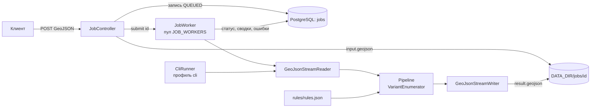
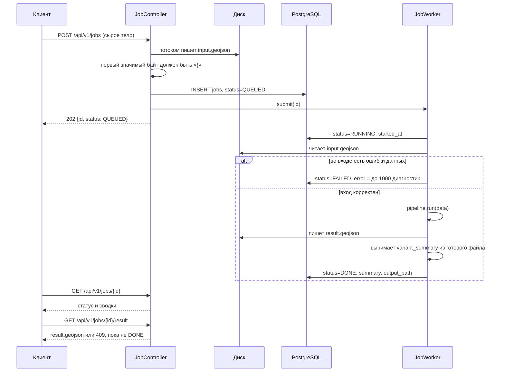
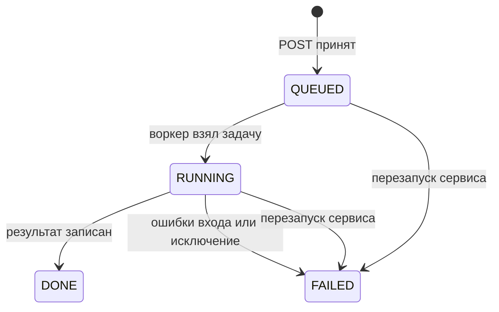
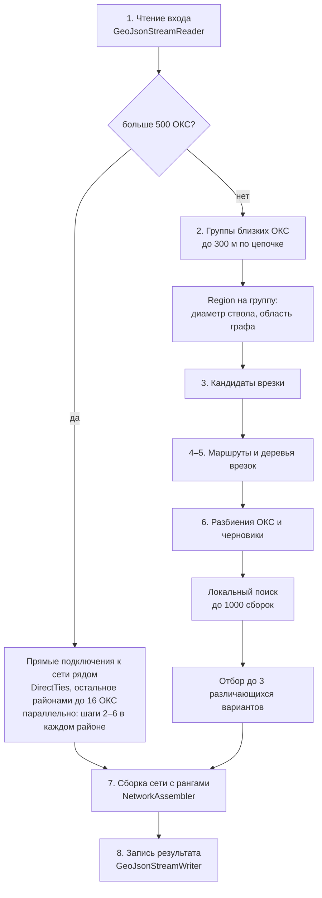
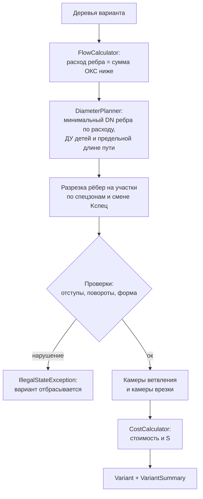
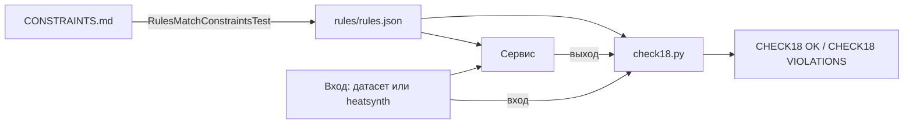

# Архитектура сервиса

**Из каких частей состоит сервис трассировки, как задача проходит через API и что происходит внутри расчёта — от чтения GeoJSON до готовых вариантов.**

[Общая схема](#общая-схема) ·
[Жизненный цикл задачи](#жизненный-цикл-задачи) ·
[Расчёт по шагам](#расчёт-по-шагам) ·
[Граф и маршрут](#4-маршрут-граф-видимости) ·
[Дерево](#5-дерево-одной-врезки) ·
[Варианты](#6-варианты-и-локальный-поиск) ·
[Большой вход](#большой-вход-расчёт-по-районам) ·
[Сборка](#7-сборка-сети) ·
[Проверка](#правила-и-проверка)

> [!NOTE]
> Запуск, переменные окружения и примеры запросов — в [BACKEND.md](BACKEND.md). Правила кейса — в [CONSTRAINTS.md](CONSTRAINTS.md). Почему выбран такой алгоритм — в [ADR-0001](../docs/adr/0001-routing-approach.md) и [ADR-0002](../docs/adr/0002-partition-local-search.md).

## Общая схема

Сервис — одно приложение на Spring Boot. Расчёт не зависит от веба и базы: одно и то же ядро `Pipeline` вызывают и REST-воркер, и CLI.

| Пакет | Роль |
|---|---|
| `api` | REST, сущность задачи, воркер и обработчик ошибок |
| `cli` | запуск расчёта из командной строки, профиль `cli` без веба и базы |
| `core` | интерфейс `Pipeline` и его реализация, которая создаёт `VariantEnumerator` на каждый запуск |
| `io` | потоковое чтение и запись GeoJSON, перевод EPSG:4326 ↔ EPSG:32637 |
| `model` | входные объекты и объекты результата |
| `rules` | загрузка `rules/rules.json`: диаметры, стоимости, отступы, коэффициенты |
| `graph` | зоны препятствий, граф видимости между вершинами зон, кратчайший путь |
| `plan` | кандидаты врезки, деревья, варианты, сборка сети |
| `calc` | расходы, диаметры, стоимость, ранжирование, критерии |

## Жизненный цикл задачи

Детали, которые влияют на поведение:

| Решение | Зачем |
|---|---|
| Тело запроса пишется на диск как есть, без multipart | файл до 3 ГБ не держится в памяти и не упирается в лимиты Tomcat; пустое тело или не JSON-объект удаляют каталог задачи и дают `400` |
| Запись задачи коммитится до `submit` | воркер всегда видит задачу в базе |
| Каждая смена статуса — отдельная короткая транзакция | расчёт идёт вне транзакции |
| Воркер ловит `OutOfMemoryError` и `StackOverflowError` | иначе задача навсегда осталась бы в `RUNNING` |
| Сводки для API берутся из записанного `result.geojson` | числа в API и в файле совпадают до знака, `12.30` не превращается в `12.3` |
| При старте все `QUEUED` и `RUNNING` становятся `FAILED` с сообщением «Задача прервана перезапуском сервиса» | очередь в памяти после рестарта не восстанавливается |

<b>Хранение задач в PostgreSQL</b>

 

Таблица `jobs` создаётся из `src/main/resources/schema.sql` при каждом старте (`CREATE TABLE IF NOT EXISTS`), Hibernate схему не трогает. Сами GeoJSON в базе не лежат, только пути к файлам.

| Поле | Что хранит |
|---|---|
| `id` | UUID задачи, он же имя каталога `DATA_DIR/jobs/<id>/` |
| `status` | `QUEUED`, `RUNNING`, `DONE`, `FAILED` |
| `created_at`, `started_at`, `finished_at` | времена этапов |
| `error` | `jsonb`: `{"message", "errors": [{featureId, field, problem}]}` |
| `summary` | `jsonb`: массив `variant_summary` из результата |
| `input_path`, `output_path` | пути к `input.geojson` и `result.geojson` |

## Расчёт по шагам

`PipelineImpl` загружает `rules.json` один раз на процесс и на каждый вызов создаёт новый `VariantEnumerator`. Всё состояние расчёта живёт в этом объекте, поэтому параллельные задачи друг другу не мешают.

### 1. Чтение входа

`GeoJsonStreamReader` идёт по файлу потоком и не держит его целиком в памяти. Файл читается блоками по 1 МБ, фичи разбирает пул потоков по числу ядер, а главный поток сливает готовые части по порядку файла, поэтому диагностики и порядок объектов те же, что при чтении в один поток. Разбор фичи идёт своим байтовым разборщиком без дерева Jackson: координаты сразу ложатся в упакованные последовательности, числа читаются тем же путём, что `Double.parseDouble`. Всё, что он не узнаёт (экранирование, не-ASCII, необычный порядок ключей), разбирает Jackson. Дальше строится геометрия: проверка валидности и перевод в EPSG:32637 (UTM 37N), где все длины и отступы считаются в метрах.

Границы фич ищутся тремя способами, от быстрого к надёжному:

1. **Строками.** Если фичи лежат по одной на строку, как в файле «город», блок режется по переводу строки и границы внутри куска находит сама нить пула. Кусок за концом массива `features` не разбирается, а если успел начать до того, как главный поток нашёл конец массива, файл перечитывается срезами: иначе объекты чужого массива попали бы в таблицу `id`. Если фича переходит через перевод строки, строка длиннее 16 МБ или диагностике нужен номер фичи, файл читается вторым способом.
2. **Срезами.** Главный поток находит байтовые границы фич подсчётом скобок с учётом строк и экранирования, фичи разбирает пул.
3. **Деревьями.** Если смещения разошлись с фичей (другая кодировка), файл читается Jackson на главном потоке.

Чтение идёт в два прохода. Первый берёт всё, кроме зданий и ограничений, а у них только проверяет синтаксис без разбора координат. По его итогу считается рамка, вне которой препятствия на расчёт не влияют. Второй проход читает только препятствия: каждое проверяется как обычно, в память ложатся те, что пересекают рамку. Если первый проход нашёл ошибки, второй читает весь файл, как раньше. Файл «город» на 3,2 ГБ читается так за 16–21 с (было 48–59 с). Ошибки данных копятся как `Diagnostic`: нет обязательного поля, не тот тип, повтор `id`, ссылка в пустоту, невалидная геометрия. Если хоть одна есть, расчёт не запускается.

Читатель принимает и формат раздела 12 CONSTRAINTS.md, и формат датасета организаторов. В датасете нет `upstream_object_id`, текущего расхода сети, диаметра камер и `oks_future`, а здания заданы ограничениями `oks`. Недостающее читатель выводит после прохода по файлу:

| Чего нет во входе | Как выводится |
|---|---|
| направление сети | обходом от источника по стыкам концов участков |
| диаметр камеры | наибольший диаметр примыкающих участков |
| текущий расход участка | по его диаметру |
| перспективный ОКС | по точке подключения внутри здания |

Правила вывода записаны в [interpretation.md](../docs/interpretation.md), валидатор выводит то же самое независимо.

### 2. Группы и области

ОКС, чьи точки подключения ближе 300 м друг к другу по цепочке, объединяются в группу. На каждую группу создаётся `Region`:

- **диаметр ствола** — по суммарному расходу группы плюс одна ступень запаса, чтобы отступы были верны и для участков, которые позже поднимут по предельной длине. Дерево подмножества строится по графу диаметра своего расхода с той же ступенью запаса, но не больше диаметра группы;
- **область графа** — прямоугольник вокруг точек подключения и кандидатов врезки с запасом 150 м и широкая область с запасом 600 м для повторной попытки;
- **кэши** — построенные деревья по подмножествам ОКС и `Router` по паре «диаметр, область».

Граф строится за время, квадратичное по числу узлов, поэтому он строится на область группы, а не на весь город; рёбра считаются параллельно по узлам. Здания и ограничения читаются только в рамке перспективных ОКС с запасом 2,5 км, а точки дальше предельной длины наибольшего Ду (11 276 м) от сети в рамку не входят: их здания на расчёт не влияют (на городе это 82 432 зданий-препятствий вместо 3,14 млн).

### 3. Кандидаты врезки

`TieInFinder` для каждой точки подключения берёт три ближайшие камеры и перпендикулярные проекции на три ближайших участка сети. Проекция становится врезкой в камеру, если камера не дальше `max_dist_m` (10 м) и после подключения у неё будет не больше `max_segments` участков. Из нескольких таких камер берётся ближняя. Иначе врезка идёт в трубу, и в точке врезки ставится новая камера; её Ду не меньше Ду трубы, ведь обе части разрезанной трубы к ней примыкают.

Если точка подключения ближе 1,2 м к оси трубы, врезка по перпендикуляру дала бы отрезок короче метра: правило длины подотрезка его не пропускает, и трасса уходила петлёй по зоне трубы. Поэтому врезка сдвигается вдоль оси к середине участка так, чтобы до точки было 1,2 м. На датасете организаторов точки не ближе 23 м к сети, сдвиг срабатывает только на сценах, где здания стоят вплотную к трубам.

Если все ближайшие кандидаты дают одну и ту же врезку, а вариантов нужно минимум два, `TieInFinder.along` ищет врезку в той же сети дальше 20 м от лучшей.

### 4. Маршрут: граф видимости

Все полигоны ОКС — препятствия, и здание с подключаемой точкой тоже (приложение 18.09, п. 2.2). Зоны запрета хранятся по одной на объект со своим id: финальный прямой участок к точке подключения проверяется без зоны своего здания. `TreeBuilder.portal` ставит точку выхода на луче от точки через ближайшую точку внешнего контура здания сразу за зоной отступа и дальше, пока выход в чужой зоне; если участок до выхода недопустим или луч снова входит в своё здание, пробуются ближайшие точки других сторон. Зона для точки выхода берётся с углами `JOIN_MITRE`: по точной зоне выход между частями здания попадал в тупик. Отступ берётся по Ду графа дерева, а он бывает на ступени выше Ду ветки: граф строится для всего блока с запасом. Если по Ду графа ближняя сторона закрыта, а по Ду участка точки (по её расходу) открыта, выход ставится по Ду участка, ветка от него идёт по графу этого Ду, а отступы такого дерева при проверке считаются по Ду каждого участка (`Tree.narrow`). Если от этого выхода ветки к дереву нет, точка не переходит на выход по Ду графа через дальнюю сторону: п. 2.2 разрешает другую сторону, только когда ближняя закрыта. Такая точка уходит из дерева в `tree.unconnected` и подключается отдельно, попытками из пункта «Без маршрута». По той же причине дерево, которое сборка отвергла, заново по графу блока не строится. Маршрут ищется от точки выхода, ветка начинается прямым участком точка–выход.

Дейкстра не релаксирует ребро, которое ломает путь в узле круче 90°: поворот считается по предшественнику узла, поэтому путь может быть не кратчайшим среди путей с поворотами до 90°, зато таблица остаётся линейной по узлам. Узлы графа не ставятся в полосе `margin_m` вокруг дорог и путей, а узлы для их пересечения стоят у внешней границы полосы: так спецпроход — один прямой участок от узла до узла.

Учебная сцена, построенная тем же способом, что в <code>ObstacleSet</code> и <code>Router</code>: <code>scripts/docs_assets.py</code>.

#### Зоны и узлы

Зона запрета — точки ближе минимального отступа плюс половины ширины пары труб к существующему зданию, парку, социальному объекту, запретной территории, воде. `ObstacleSet` проверяет её точным расстоянием до сторон объекта с запасом 0,05 м, как правило и check18, а не по буферу. Буфер с углами `JOIN_MITRE` торчит у угла здания на d·√2: он закрывал проходы между углами соседних зданий и уводил трассу от угла. Стороны объекта лежат в массиве кусками по 8 с общей рамкой; отрезок дальше круга вокруг объекта с отступом отсеивается без перебора сторон.

Узлы графа — выпуклые вершины буферов `JOIN_MITRE` на 0,15 м шире отступа и точки вдоль сторон дорог, не лежащие ни в одной зоне. Если вершина угла попала в зону соседа, вместо неё ставятся две вершины описанного многоугольника. Узлы берутся только внутри области графа: зона дороги или магистрали длиной в километры иначе приносит узлы далеко за областью, а граф строится за время, квадратичное по числу узлов.

Зоны запрета лежат в равномерной сетке `ZoneGrid`. Отрезок проверяется обходом клеток вдоль него с выходом на первой задетой зоне: у длинного ребра рамка накрывает тысячи зон, и прежний запрос к `STRtree` собирал их все, прежде чем проверить первую. На дальних районах города построение графа от этого стало в 5–7 раз быстрее.

#### Рёбра

У выпуклой вершины запоминаются соседи по кольцу зоны. Ребро проверяется, только если касается зоны в обоих концах, то есть не уходит внутрь угла. В кратчайшем пути других рёбер не бывает, а геометрических проверок становится в несколько раз меньше. Ребро допустимо, если:

- не заходит в запрещённую зону;
- дорогу и трамвайные пути пересекает под углом не меньше 45°;
- газопровод, кабель и существующую теплосеть либо пересекает, либо проходит от них не ближе отступа.

Вес ребра — длина плюс надбавка `(Kспец − 1) × длина специального прохода`.

#### Кратчайший путь

`Router` строит граф один раз в конструкторе и хранит его массивами смежности. Дейкстра идёт от виртуального источника по массивам, цель выбирается по сумме расстояния до узла и веса от узла до цели.

<b>Кэши и отсечения, которые ускоряют поиск в два с лишним раза</b>

 

| Приём | Как работает |
|---|---|
| Точки запроса не добавляются в граф | веса от точки до всех узлов считаются отдельно и кэшируются по координате: одна точка подключения и одни и те же цели дерева запрашиваются десятки раз за построение |
| Кэш таблиц Дейкстры | таблица от точки запроса хранится по координате и набору пропускаемых объектов; локальный поиск запрашивает одни и те же точки сотни раз, на датасете организаторов из кэша берётся 99 % таблиц |
| Ленивые веса целей | цели дерева меняются с каждым черновиком, поэтому вес от цели до узла считается, только если нижняя оценка — по графу до узла плюс по прямой до цели — бьёт уже найденный вес |
| Отсечение далёких целей | цель, до которой расстояние по прямой не меньше лучшего веса, не проверяется вовсе |
| Узлы по возрастанию веса | таблица Дейкстры помнит порядок, в котором узлы получили окончательный вес; для цели узлы перебираются в этом порядке, пока вес узла меньше лучшего найденного |
| Предел по лучшей цели | цель выигрывает, только если её вес с надбавкой меньше лучшего среди уже проверенных целей, поэтому узлы дальше этого веса не перебираются; раньше цель без прямой видимости обходила все узлы графа |
| Точные сравнения без `hypot` и `atan2` | сумма «вес узла плюс прямая» и поворот до 90° сравниваются через квадраты и косинус с запасом, в спорной полосе вызывается прежняя функция |
| Массивы вместо карт | Дейкстра и точный поиск по состояниям «узел, откуда пришли» хранят веса и предшественников в массивах, куча повторяет порядок `PriorityQueue` |

Результат с отсечениями и без них побайтно один и тот же.

#### Спрямление

Если на пути остаётся излом меньше 3°, а убрать вершину нельзя, вершина сдвигается от хорды шагами 0,5–8 м. Сетки 45° и надбавки за угол в редакции правил от 18.09 нет: угол поворота в пределах 90° любой.

Затем `Router.cutPass` срезает вершины пути хордами в два прохода. Хорда держит отступ с запасом 0,2 м, как буфер узлов графа до упрощения, не пересекает спецобъектов и не оставляет подотрезков короче 1,05 м; срезы кэшируются по тройке вершин. Узлы графа стоят на вершинах буферов, и путь по ним обходит угол здания шире нужного. Хорда короче 10 м даёт два поворота подряд, и следующий шаг возвращает на её место прежний угол, если он проходит проверку; срезка остаётся там, где хорда длиннее или угол не вернуть, а её вершины часто убираются совсем.

После срезки `Router.sharpen` доводит форму по разделу 5 правил: участки прямые с поворотами, без необоснованных изломов, зигзагов и ступенек. Поворот — вершина с отклонением от 3°. Шаги повторяются, пока форма меняется:

1. Вершина убирается, если её соседей по обычному участку можно соединить прямой. Сосед — соседняя вершина или граница специальной части на соседнем отрезке: там сборка ставит технический узел, граница становится вершиной, а спецпроход остаётся прежним прямым участком. Так уходят и вершины в сантиметрах от технического узла: узлы графа для пересечения дороги стоят у внешней границы полосы margin_m. Сосед, у которого после этого излом меньше 3°, убирается вместе с вершиной. Первой убирается вершина, которая сильнее укорачивает трассу.
2. Так же одной прямой убираются две вершины со звеном короче 10 м между ними: это спрямляет зигзаг.
3. Повороты подряд в одну сторону со звеньями короче 10 м заменяются наименьшим числом поворотов. Прямые входа, выхода и части средних звеньев продолжаются до пересечения, поворот в пересечении равен сумме поворотов между ними. Варианты идут по числу поворотов, при равном числе — по длине. Два поворота подряд остаются, только если их сумма больше 89,9° или вершина пересечения не проходит проверку.

Вершины убираются раньше, чем заменяются повороты: удаление укорачивает трассу, замена удлиняет. Порога по величине отдельного поворота нет. Каждая замена проверяется как хорда срезки, но с меньшим запасом отступа: 0,15 м сверх нормы, без спецпрохода, не ближе 0,5 м к другим рёбрам дерева и к своей ломаной, в пределах области графа; поворот не круче 89,9°, звено не короче 1,05 м. Так толкуется п. 5: поворот обоснован, если без него трасса подошла бы к зоне ближе нормы плюс 0,15 м. `ObstacleSet.plain` отсчитывает запас от нормы: зона и так шире нормы на 0,05 м, и прежде форма держала 0,2 м, оставляя вершины с запасом прямой 0,15–0,2 м. Точка выхода из здания остаётся на месте. Маршрут с доведённой формой кэшируется по ломаной: маршрут между теми же точками строится за расчёт десятки раз.

### 5. Дерево одной врезки

`TreeBuilder` растит дерево от врезки эвристикой Такахаши–Мацуямы: на каждом шаге присоединяется ОКС с самым лёгким маршрутом до уже построенного дерева. Маршрут обрезается в первой точке касания дерева, там ставится камера ветвления.

- **Только новые цели.** Дерево на шаге только растёт, и цели, оставшиеся с той же надбавкой, дают прежние веса. Если прежняя лучшая цель ОКС на месте, `Router.choose` сравнивает её с лучшей из новых целей шага и не перебирает остальные; при равных весах выбор зависит от порядка целей, и тогда цели перебираются все. Датасет организаторов с этим считается 3,7 с вместо 4,4.
- **Место в камере.** Если у камеры нет свободного места — больше трёх ответвлений нельзя, — ответвление переносится на соседнюю точку ствола.
- **Надбавки.** Точка посреди ребра платит стоимость новой камеры, второй и следующий луч из существующей камеры врезки — стоимость врезки. Рубли переводятся в метры по весам формулы S, поэтому ветка предпочитает свободный луч, пока крюк до него короче цены камеры.
- **Повороты.** Ветка с поворотом круче 90° отбрасывается, и пробуется следующее место присоединения; сборка проверяет повороты ещё раз, включая технические узлы.
- **Без маршрута.** ОКС, до которых маршрута нет, остаются в `tree.unconnected`. Для одиночного ОКС есть три повторные попытки: с диаметром по расходу самого ОКС вместо диаметра ствола, затем на широкой области, затем точным поиском `Router.routeExact` на широкой области. Точный поиск ведёт состояние «узел и откуда в него пришли», поэтому находит путь, в который нужно войти с другой стороны, и держит поворот не круче 90° уже в точке выхода из здания. Он дороже обычного, поэтому включается только там, где точка иначе остаётся без сети: штраф за неподключение от 100 млн (п. 2.1, 2.5).

### 6. Варианты и локальный поиск

`VariantEnumerator.run` собирает черновики (`Draft`) по разбиениям ОКС:

| Разбиение | С лучшей врезкой | С другой врезкой |
|---|---|---|
| каждый ОКС отдельно | да | да |
| группы близких ОКС | да, если есть группа больше одного ОКС | да |
| группы от трёх ОКС, разбитые k-means на две | да, если такие группы есть | нет |

Внутри черновика подмножества идут по убыванию размера. Каждое берёт лучшее дерево, которое не пересекается с уже принятыми. Деревья строятся не на всех кандидатах врезки, а на шести лучших по грубой оценке: прямые от точек подключения по цене трубы плюс новая камера, если врезка в трубу. Деревья кандидатов и сторон выхода одного подмножества считаются параллельно (`heatnet.search.parallel`): граф и кэш маршрутов общие и потокобезопасны, результаты складываются в порядке кандидатов, поэтому выход не зависит от расписания нитей. Проверка отступов дерева берёт зоны из кэша области, а не строит их на каждое дерево. Вне районов города деревья всех ещё не посчитанных подмножеств разбиения строятся заранее и параллельно в своём пуле: черновик берёт подмножества по одному, а ядер больше.

Из каждого дерева собираются формы, и в черновик идёт лучшая по S из тех, что собрались:

- дерево как построено;
- срезанное: вершины рёбер срезаются хордой не ближе 0,5 м к другим рёбрам, форма доводится `Router.sharpen`, точка выхода из здания остаётся на месте (`TreeBuilder.cut`). Ребро проверяется по зонам Ду расхода точек ниже него, если этот Ду меньше Ду графа: проверка сдаваемых участков меряет отступы по Ду участка, и вершина не должна остаться лишней из-за зон ствола. Такое дерево сборка проверяет по Ду участков. Если срезанное не собралось, пробуется несрезанное с доведённой формой и только потом дерево как построено;
- с врезкой, перенесённой к вершине ствола (`slid`): у каждой вершины ствола пробуется проекция на трубу врезки и кандидаты врезки самой вершины — три ближайшие камеры и проекции на три ближайших участка; перенос берётся, если ствол с ценой узла врезки короче хотя бы на 1 м;
- со стволом, проложенным заново от первой камеры ветвления к ближайшим к ней кандидатам врезки (`rerooted`), затем тот же перенос вдоль новой трубы.

В районах города перенос идёт только вдоль своей трубы, а новый ствол не строится: поиск кандидатов у каждой вершины перебирает все камеры. Если все деревья пересекаются, `merged` пробует снять мешающее дерево той же группы и построить одно общее. Черновик, который не собирается `NetworkAssembler`, отбрасывается.

От лучшего черновика идёт локальный поиск по разбиениям ОКС (`search`). Каждый ход на схеме выше — новый черновик той же процедурой.

1. Спуск принимает первое улучшение.
2. Из локального оптимума он шагает на наименее плохого ещё не посещённого соседа, если тот хуже текущего не больше чем на 0,5 S, и спускается снова.
3. Когда и такого соседа нет, спуск перезапускается от лучшего найденного черновика по его наименее плохому непосещённому соседу уже без порога.
4. Возвращается лучший найденный черновик.

> [!TIP]
> Поиск ограничен только числом сборок (`heatnet.search.budget`, 1000) и остановкой после 100 сборок без улучшения (`heatnet.search.stall`), предела по стенным часам нет. Результат на любой машине один и тот же. Остановка по застою действует только после того, как перебраны все соседи начального черновика: с переносом врезки к стволу поиск иначе останавливался на первых соседях. Датасет организаторов останавливается на 100 сборках, «густо» 100 и 200 — на 740 и 776. В районах города застой прежний, 50 сборок (`heatnet.city.stall`), и бюджет 60.

Выигрыш дают слияния: одна камера врезки и общий ствол вместо нескольких. Черновик, где без сети осталось больше точек, чем в лучшем, не выдаётся: намеренное неподключение запрещено (п. 2.5). Для вариантов 2 и 3 от лучшего черновика строятся ещё черновики с другой врезкой у каждого из восьми крупнейших блоков (до трёх отличных врезок) и с разбиением блока пополам. Перенос врезки к стволу сводит другие врезки блока на ту же трубу, и их трассы совпадают с первыми вариантами. Поэтому, если набралось два варианта, вне районов города такие же черновики строятся ещё от блоков второго варианта с врезками без переноса: на датасете организаторов так появляется третий вариант. Черновики сортируются по S. Вариант берётся, если он отличается от уже выбранных — другим объектом врезки, врезкой дальше 20 м или разбиением ОКС — и не совпадает с ними по трассе. Совпадением считается, когда больше 90 % длины меньшего варианта лежит в полосе 1 м от другого. Доля сначала оценивается снизу и сверху без буфера JTS (`RouteBand`: полоса 0,95 м за вычетом допустимых наложений рёбер и 1,05 м), буфер строится, только если оценки не решают. Если так набирается меньше двух вариантов, отбор повторяется без проверки трассы. Выбранные до трёх вариантов собираются заново с рангами 1, 2, 3.

### Большой вход: прямые подключения и районы

Перебор из раздела 6 рассчитан на десятки ОКС: граф области квадратичен по числу узлов, а черновики и поиск растут быстрее n². Если перспективных ОКС больше 500 (`heatnet.city.min`), `VariantEnumerator.city` считает вход иначе.

1. **Прямые подключения.** `DirectTies` для каждой точки подключения по порядку берёт три ближайшие существующие камеры со свободным местом, три ближайшие трубы (проекция, а в 10 м от камеры — камера) и уже поставленные новые камеры в 300 м (`heatnet.city.reach`) с местом ещё для одного участка; у камеры на трубе места на два участка меньше за каждую проходящую трубу, на дублях труб места нет. Для каждого кандидата строится прямой участок от врезки к точке: один отрезок, если врезка внутри здания точки или в его зоне отступа, иначе два — через точку выхода на луче к ближайшей точке контура, а если там не проходит, к следующим по расстоянию сторонам. Участок проверяется на отступы к зданиям, запретным ограничениям и сети; дорогу, пути и линии он может пересечь спецпроходом под допустимым углом. Берётся самый дешёвый по длине, Ду и узлу; второй вариант города берёт второго по стоимости кандидата, оба набора деревьев строятся за один обход точек с раздельным учётом мест в камерах. Точка вне рамки сети с запасом 300 м кандидатов не получает: любой из них дальше 300 м. Кандидаты ближних точек и допустимость участков к ним считаются параллельно, выходы из здания — один раз на точку, участки к уже поставленным новым камерам — пачкой на 32 точки вперёд; места в камерах и новые камеры распределяются последовательно в прежнем порядке точек, поэтому выход тот же, что при расчёте в одну нить. Если у точки нет ни одного прямого подключения, а труба ближе 3 м (в синтетическом городе труба проходит через здание точки), врезка сдвигается вдоль трубы на 0,5–15 м в обе стороны, пока остаётся в зоне своего здания; участок от неё может пересечь чужую трубу спецпроходом, и такое дерево сначала собирается пробно. Точки без допустимого прямого участка идут в районы, а точки дальше предельной длины наибольшего Ду (11 276 м) от сети остаются без маршрута сразу: ни один путь к ним не уложится в предел ни при каком диаметре; расстояния до сети считаются параллельно.
2. **Районы.** Оставшиеся ОКС делятся на группы близких ОКС, как в разделе 2. Крупные группы режутся пополам (k-means или по длинной стороне рамки), пока в районе не останется не больше 16 ОКС (`heatnet.city.block`).
3. **Расчёт районов.** Каждый район считается тем же перебором из раздела 6 на своих ОКС. Сеть, препятствия и их индексы общие, кэш маршрутов у района свой. Районы идут параллельно по числу ядер (`heatnet.city.threads`), ближние к сети первыми: их графы меньше. Районы, не начатые за `heatnet.city.deadline` секунд от старта городского расчёта (300), не считаются, их точки остаются без сети; на синтетическом городе десятки тысяч точек лежат в 5–11 км от сети, и их графы считались бы часами. Районы ближних точек досчитываются за ~110 с, последний район, давший дерево, — за ~230 с; срок 900 с даёт тот же выход. В районе действуют упрощения: кандидаты врезки дальше ближайшего больше чем на 150 м отбрасываются, область графа — не прямоугольник, а полоса вдоль прямых от точек к кандидатам врезки шириной 25 % длины, но не уже 60 м (`heatnet.city.corridor`), у графа один диаметр на район и нет широкой области, поиск тратит 60 сборок вместо 600.
4. **Сборка.** Прямые подключения собираются по узлам врезки параллельно с общими счётчиками ID, деревья районов — одной сборкой; дерево района, задевающее уже принятое дерево соседа, не берётся. Сводка складывается из частей, ранг кандидату даёт S всего варианта.

### 7. Сборка сети

`NetworkAssembler` превращает деревья варианта в объекты результата. Деревья с общей точкой врезки собираются в один узел. При врезке в существующую камеру участки начинаются в ней (ссылка на её входной `id`), и каждый такой участок — врезка за 5 млн руб. При врезке в трубу узел врезки — новая камера `heat_chamber`, её стоимость включает присоединение.

| Этап | Что делает |
|---|---|
| **Расходы** | `FlowCalculator` обходит дерево от листьев к корню: расход ребра равен сумме расходов ОКС ниже по дереву |
| **Диаметры** | `DiameterPlanner` идёт от листьев к корню: ДУ ребра — наименьший, который проходит по расходу, не меньше ДУ дочерних рёбер и укладывает в предельную длину самый длинный путь одного ДУ через ребро; на ребре ДУ один, узел без смены ДУ отсчёт не начинает |
| **Разрезка** | участок делится техническим узлом на границах спецзон и там, где меняется наибольший Kспец; специальный участок с вершиной внутри отбрасывается: спецпроход — один прямой участок |
| **Проверки** | отступы от объектов специального прохода, поворот не круче 90° в вершинах и технических узлах, форма участков; нарушение отбрасывает вариант |
| **Проверки с запасом к валидатору** | валидатор считает узлы ближе 0,05 м одним узлом, а координаты выхода округлены до 9 знаков. `checkApart` и проверка при разрезке отбрасывают дерево, если узлы разных участков ближе 0,06 м, участки касаются вне общих узлов или сами себя, спецкусок не длиннее 0,12 м, обычный и специальный участки ближе 0,06 м без общего узла или расходятся из узла под углом меньше 30,5°, обычный кусок перекрывает зону больше чем на 0,1 м. Такие деревья получались на плотной застройке у самых труб; на датасете организаторов проверки не срабатывают |
| **Стоимость** | новые участки (`длина × цена за метр DN × Kспец`), новые камеры, врезки в существующие камеры, штраф за неподключённые точки; суммы до копеек, S до трёх знаков; реконструкции по редакции 18.09 нет |

### 8. Запись результата

`GeoJsonStreamWriter` переводит геометрию обратно в EPSG:4326 и пишет результат потоком, по фиче на строку. В файле лежат объекты всех вариантов: новые участки, новые камеры, технические узлы и `variant_summary` на каждый вариант; ссылки на объекты входа с числовым `id` записаны числом. Глубины `depth_start` и `depth_end` всегда `null`: расчёт идёт только в плане.

## Правила и проверка

Все таблицы и коэффициенты кейса лежат в `rules/rules.json`. Java-сервис и Python-инструменты читают только этот файл, поэтому числа в коде не дублируются.

Что числа в `rules/rules.json` совпадают с таблицами CONSTRAINTS.md, проверяет Java-тест `RulesMatchConstraintsTest`.

Валидатор `tools/validator/check18.py` не использует код сервиса. Он читает вход и выход и проверяет выход по техническому приложению и разъяснениям от 18.09.2026: состав объектов и ссылки узлов, геометрию и отступы, расходы и ДУ, камеры и врезки, стоимость и сводку. Отдельно он проверяет, что финальный участок идёт от ближайшей стороны здания, если она открыта, углы и полосы спецпроходов, пересечение существующей сети только спецпроходом и касания новых участков вне общих узлов. Ограничение типа, которого нет в `rules.json`, он считает запретом с отступом `_fallback`, как сервис. Нарушения он печатает по категориям и заканчивает строкой `CHECK18 OK`, если их нет. Этим же валидатором `PipelineSampleIT` проверяет выход на `data/samples/small-1.geojson`.

Часть допусков в сервисе подобрана под то, как считает валидатор: узлы ближе 0,05 м он считает одним узлом, координаты выхода округлены до 9 знаков. Такие места помечены комментариями в `TieInFinder`, `TreeBuilder`, `Router` и `ObstacleSet`.

> [!NOTE]
> Ограничения решения — эвристика без гарантии минимума, только план без глубины — перечислены в разделе «Границы применения» [BACKEND.md](BACKEND.md#границы-применения).
