# Как работает алгоритм

Документ для члена жюри или инженера, который не читал код. В нём три части: шаги расчёта от входного GeoJSON до готовых вариантов, таблица, где у каждого правила организаторов указано, как сервис его соблюдает и чем это проверено, и угловые случаи с картинками. Каждая картинка нарисована по настоящему выходу сервиса версии 0.9.0 на маленьком синтетическом входе. Датасет организаторов на картинках не показывается, о нём здесь только числа.

Первоисточники правил — техническое приложение и разъяснения организаторов от 18.09.2026, их выписка — [CONSTRAINTS.md](../architecture/CONSTRAINTS.md), раздел 19. Места, которые допускают больше одного прочтения, и как их читают сервис и проверщик, записаны в [interpretation.md](interpretation.md). Подробности реализации по классам — в [ARCHITECTURE.md](../architecture/ARCHITECTURE.md).

**Результат v0.9.0 на датасете организаторов:** S 12,748, стоимость 265,8 млн руб., подключены 17 точек из 17, один вариант (остальные найденные совпадали бы с ним трассой), расчёт около 3 с. Строгий [check18](../tools/validator/check18.py) нарушений не находит.

## Кто проверяет выход

`tools/validator/check18.py` — проверщик на Python, написанный отдельно от сервиса: он не вызывает код сервиса и читает только вход, выход и `rules/rules.json`. Он заново считает отступы, углы, расходы, диаметры, стоимость и S. Нарушения он печатает по категориям: A — состав файла и ссылки, B — геометрия и отступы, C — расходы и Ду, D — камеры, E — стоимость и сводка. Если нарушений нет, последняя строка — `CHECK18 OK`. «Строгий» здесь значит запуск без флага `--no-shape`: тогда включены проверки формы трассы B16–B22 и входа в здание B8.

```bash
uv run --project tools python tools/validator/check18.py <вход.geojson> <выход.geojson>
```

## Конвейер расчёта

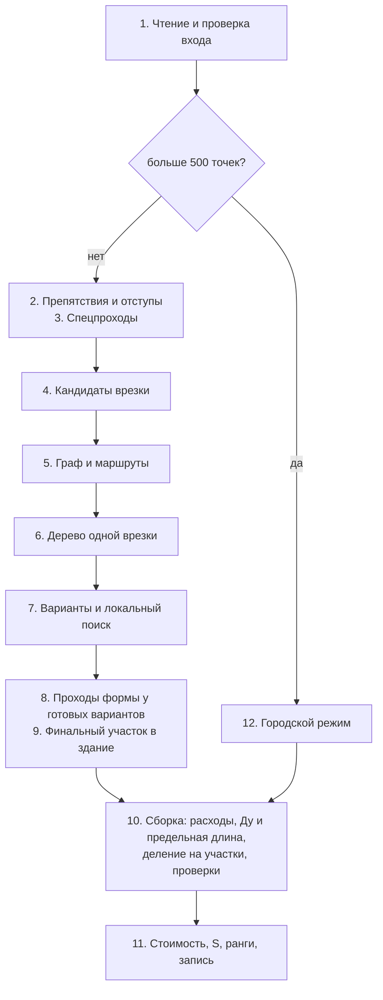

### 1. Чтение и проверка входа

`GeoJsonStreamReader` читает файл потоком и не держит его в памяти целиком: так читается и вход в 3 ГБ. Каждая геометрия проверяется на валидность по OGC. Если во входе есть ошибка данных (нет обязательного поля, невалидный полигон, повтор `id`, ссылка в пустоту), расчёт не запускается: задача получает статус `FAILED` со списком «объект, поле, что не так».

Сервис принимает и формат из ТЗ, и формат датасета организаторов. Идентификатор может быть строкой или любым числом JSON, в том числе `11.0`: приложение 18.09 (разд. 1) требует не интерпретировать формат `id`, и в выходе ссылка пишется тем же числом. Источников `source` может быть сколько угодно или не быть совсем: каждая система сети направляется от своего, расчёт источник не использует. Ду существующей сети вне таблицы 1 сервис округляет до табличного вверх, объекты незнакомого типа пропускает с предупреждением; подробности — в [interpretation.md](interpretation.md). Сеть, не связанная ни с одним источником по стыкам участков, не роняет расчёт: в неё тоже можно врезаться (разъяснение 11), CLI печатает одну строку предупреждения. Все длины и отступы считаются в метрах в EPSG:32637.

### 2. Препятствия и отступы

Все полигоны `restriction_type = oks` — препятствия, включая здание, в котором лежит сама точка подключения (п. 2.2). Во входе формата раздела 12 так же читается полигон `oks_future`: он и препятствие для чужих трасс, и своё здание своей точки. Вокруг каждого препятствия строится зона запрета: точки ближе нормы. Норма — отступ из таблицы 2 плюс половина ширины пары труб по таблице 1, а у линии со своим габаритом ещё её полуширина (разд. 3.1). Для здания отступ 5 м при Ду до 400, 7 м при Ду 500–800 и 9 м от Ду 900. `ObstacleSet` проверяет зону точным расстоянием до сторон объекта, так же, как check18. У своего здания от отступа освобождён только финальный прямой участок к точке.

### 3. Спецпроходы

Дорогу, трамвайные пути, газопровод, кабель и существующую сеть можно пересечь только специальным проходом (табл. 2):

- спецпроход — один прямой отрезок, на его границах стоят технические узлы (разд. 4);
- у дороги и путей спецучасток — часть трассы в полигоне и по 3 м вдоль трассы за его границей, угол к стороне полигона в точке входа не меньше 45° (разъяснение 6);
- у газопровода, кабеля и сети спецучасток — по 2 м вдоль трассы от точки пересечения, угла нет;
- за спецучастком трасса снова держит норму. У линии ближе нормы можно быть только в круге радиусом «норма + 0,1 м» вокруг точки пересечения: столько даёт пересечение под прямым углом.

Граф видимости (шаг 5) заранее ставит узлы у внешней границы полосы дороги, а вдоль газопровода и кабеля через каждые 20 м — пары узлов друг напротив друга. Так трассе есть где пересечь объект одним прямым отрезком под допустимым углом.

### 4. Кандидаты врезки

`TieInFinder` для каждой точки подключения берёт три ближайшие камеры и перпендикулярные проекции точки на три ближайших участка существующей сети. Если место врезки не дальше 10 м от существующей камеры, врезка идёт в эту камеру (п. 2.4). Условие одно: после подключения у камеры будет не больше четырёх примыканий. Иначе на трубе ставится новая камера. Если проекция попала в зону запрета (труба идёт по территории школы или у стены), врезка сдвигается вдоль трубы с шагом 0,5 м к ближайшему месту вне зон. Если ни одно из этих мест не дало точке трассы, перебираются места врезки на трубах в радиусе 150 м с шагом 2 м, и к трём лучшим по маршруту строятся деревья. Новую камеру сервис по возможности ставит вне полигона дороги или путей и полосы 3 м у его границы; камера внутри допустима (разъяснение 13 от 29.09), и если места вне полосы на трубе нет, она остаётся там. Новую камеру сразу за 10 м от существующей ради экономии на врезке сервис не ставит (разъяснение 9 от 29.09).

### 5. Граф и маршруты

Узлы графа — выпуклые вершины зон запрета и узлы у спецобъектов, рёбра — отрезки между ними, которые не заходят в зоны и пересекают спецобъекты по правилам шага 3. Вес ребра — длина плюс надбавка за спецпроход по его коэффициенту. `Router` ищет кратчайший путь Дейкстрой и не пропускает поворот круче 90° (п. 2.1, разъяснение 5). Для точки, которая иначе остаётся без сети, есть точный поиск по состояниям «узел и откуда в него пришли»: он находит путь, в который нужно войти с другой стороны.

Путь по вершинам зон обходит углы шире нужного, поэтому готовый маршрут срезается хордами и доводится до строгой формы. По п. 2.1 трасса «не должна содержать необоснованных мелких изломов, зигзагов и ступенчатых фрагментов». Лишние вершины убираются, два поворота в одну сторону заменяются одним, зигзаг спрямляется. Поворот считается обоснованным, только если без него нарушился бы один из запасов: 0,15 м сверх нормы до зоны, 0,5 м до другого участка, поворот не круче 89,9°, звено не короче 1,05 м.

### 6. Дерево одной врезки

`TreeBuilder` растит дерево от места врезки эвристикой Такахаши–Мацуямы: на каждом шаге присоединяется точка с самым дешёвым маршрутом до уже построенного дерева. Там, где ветка касается дерева, ставится камера ветвления: ветвиться можно только в камере, и к ней примыкает не больше четырёх участков (п. 2.1). Маршрут к точке внутри здания начинается прямым участком от точки до выхода из здания (шаг 9).

### 7. Варианты и локальный поиск

`VariantEnumerator` собирает черновики по разбиениям точек на группы, у каждой группы своя врезка. Локальный поиск сливает группы, переносит точки между ними и меняет врезки, пока 100 сборок подряд не дадут улучшения или не кончится бюджет в 1000 сборок. Поиск ограничен числом сборок, а не временем, поэтому вне городского режима один и тот же вход на любой машине даёт побайтово тот же выход. Черновик, где без сети осталось больше точек, чем в лучшем, не выдаётся: намеренное неподключение запрещено (п. 2.5, разъяснение 15). Из лучших черновиков берётся до трёх содержательно разных вариантов (разд. 6).

### 8. Проходы формы у готовых вариантов

Поиск собирает до тысячи черновиков, и дорогие проверки в нём не делаются. У выбранных вариантов проходы идут по порядку:

1. **Перенос и сдвиг камер ветвления** (`JunctionMover`, `TreeBuilder.slides`): камера уходит туда, где её рёбрам сходиться дешевле.
2. **Прокладка рёбер по графу своего Ду** (`rerouted`): дерево строилось по графу Ду ствола, а ветка меньшего Ду может пройти ближе к зданиям.
3. **Повороты в камерах** (`turned`, `unsharpened`): путь точки проходит камеру от последнего звена одного участка к первому звену другого, и этот поворот тоже не круче 90°. Такой поворот снимается сдвигом камеры, изломом звена у камеры или обходом камеры. Вариант, где поворот снять не удалось, не выдаётся, если есть вариант без таких поворотов.
4. **Изломы у камер** (`unkinked`), **два поворота одной вершиной** (`bent`), **изломы меньше 3° в технических узлах** (`evened`): доводка строгой формы у мест, где сходятся участки.

Каждая правка принимается, только если дерево собирается, диаметры не выросли, а трассы не касаются друг друга.

### 9. Финальный участок в здание

К точке внутри здания ведёт один прямой участок от ближайшей к ней границы полигона (п. 2.2, разъяснение 3). Сервис берёт ближайшую точку внешнего контура. Если луч через неё недопустим, перебирает точки контура через 5 см по возрастанию расстояния и берёт первую допустимую. Луч допустим, если выходит из здания один раз, в зоне отступа своего здания не подходит к нему снова и не задевает зоны чужих зданий и запретных объектов. Проход `entered` ставит вход у ближайшей допустимой точки у готовых вариантов, `straightened` убирает вершину перед финальным участком, если прямое звено входит в здание не дальше 0,1 м от ближайшей точки.

### 10. Сборка: расходы, Ду и предельная длина

`NetworkAssembler` превращает деревья в объекты выхода:

- **расход** участка — сумма `flow_tph` точек ниже по дереву (п. 2.3);
- **Ду** — наименьший диаметр, который проходит по расходу, не меньше Ду участков ниже и укладывает в предельную длину самый длинный путь одного Ду через участок. Предельная длина считается отдельно по каждому пути от точки до места присоединения, общий участок входит в каждый путь, а камера без смены Ду отсчёт не начинает (п. 2.3, разъяснения 1 и 2);
- **деление на участки**: технический узел ставится на каждой границе спецзоны и на каждой смене набора зон, коэффициент части — наибольший в наборе (разд. 4, разъяснение 8);
- **проверки**: отступы, повороты в вершинах и технических узлах, форма участков. Нарушение отбрасывает дерево, и такой вариант не выдаётся.

### 11. Стоимость, S, ранги, запись

`CostCalculator` складывает стоимость участков (длина × цена метра Ду × Kспец), новых камер по таблице 3.2, врезок в существующие камеры по 5 млн руб. и штрафов за неподключённые точки (разд. 6). S = 0,7 · C / 25 млн + 0,3 · L / 100 округляется до четырёх знаков, как 0,6913 в примере п. 7.3. Вариант с наименьшим S получает ранг 1. `GeoJsonStreamWriter` пишет выход в EPSG:4326 потоком, глубины `null`: режим с глубиной не реализован.

### 12. Городской режим

Если точек подключения больше 500, граф на весь вход строился бы часами. Тогда точки рядом с сетью подключаются прямыми участками к ближайшей камере или новой камере на трубе. Остальные делятся на районы до 16 точек, и районы считаются шагами 4–10 параллельно, от ближних к сети к дальним. Районы, не начатые за 275 с, не считаются, начатые досчитываются ещё до 40 с. Точки дальше 11 276 м от сети недостижимы: даже Ду 1400 не уложит такой путь в предельную длину. Черновики районов и прямые подключения проходят те же проходы формы шага 8; точки, отцепленные из-за поворота круче 90° в камере, считаются ещё раз по одной. Потом идёт второй проход: точки, оставшиеся без сети, группируются заново вместе с точками до трёх соседних деревьев в 150 м и считаются как район; новые деревья заменяют соседние, если подключают больше точек и не задевают остальные деревья варианта. На синтетическом городе в 3,2 ГБ подключена 12 681 точка за 334,7 с; v0.8.1 в той же паре прогонов — 13 432 за 333,3 с. Подключённых меньше, потому что камера врезки больше не ставится в дорогу. Замеры — в [performance.md](performance.md).

## Правила организаторов и их проверка

Пункты — техническое приложение от 18.09.2026 и разъяснения той же даты. Категории — строки `check18`.

| Правило | Как сервис его соблюдает | Категории check18 |
|---|---|---|
| Идентификаторы строковые или числовые, формат не интерпретируется (разд. 1, 7) | число хранится как во входе, ссылки в выходе тем же числом | A2, A3, E5 |
| Состав выхода: `heat_network`, `heat_chamber`, `technical_node`, `variant_summary` (п. 7.1) | других типов сервис не пишет, `id` уникальны | A0, A1 |
| Один путь от точки до места присоединения, без циклов (п. 2.1) | сеть — дерево от каждой врезки | C9, D4 |
| Прямые участки, поворот до 90° включительно (п. 2.1, разъяснение 5) | Дейкстра не пропускает поворот круче 90°, сервис держит 89,9° с запасом на округление; поворот в камере на пути точки правит `turned` | B1, B20 |
| Без необоснованных изломов, зигзагов и ступенек (п. 2.1, разъяснение 5) | доводка формы маршрута и проходы шага 8 | B5, B6, B16, B17, B18, B21, B22 |
| Ветвление только в камере, не больше четырёх примыканий (п. 2.1, разъяснение 12) | камера в каждой точке ветвления, место в камере учитывается | D3, D5, D6 |
| Технический узел только при смене способа прокладки (п. 2.1, разъяснение 13) | узлы только на границах спецзон | D1, D2 |
| Новые участки не пересекаются вне общего узла (п. 2.1) | сборка отбрасывает дерево с касанием | B15 |
| Здание — препятствие с отступом 5/7/9 м (п. 2.2, табл. 2) | зоны запрета по точному расстоянию | B3, B7 |
| Один финальный прямой участок от ближайшей границы своего полигона (п. 2.2, разъяснение 3) | вход у ближайшей допустимой точки контура | B4, B8, B19 |
| Расход участка — сумма расходов ниже (п. 2.3) | `FlowCalculator` | C1 |
| Ду минимальный по расходу и предельной длине, не убывает к врезке, без завышения (п. 2.3, разъяснения 1, 2) | `DiameterPlanner`; на цепочке постоянного расхода Ду один (разъяснение 20 от 29.09) | C0, C2, C3, C4, C5, C6, C7 |
| Присоединение через камеру, существующая камера ближе 10 м обязательна (п. 2.4, разъяснение 11) | `TieInFinder` | D7, D8, D9, D10 |
| Неподключение только при отсутствии допустимого маршрута (п. 2.5, разъяснение 15) | черновик с лишней неподключённой точкой не выдаётся; повторные попытки для точки без маршрута | нет категории; `scripts/check.sh organizers` проверяет, что все точки датасета подключены |
| Запретные объекты: парк, вода, железная дорога и другие (табл. 2) | зоны запрета | B7 |
| Спецпроход — один прямой участок (разд. 4, разъяснение 6) | граф и сборка не берут ломаный спецучасток | B2 |
| Угол пересечения дороги и путей не меньше 45° (табл. 2, разъяснение 6) | ребро графа под меньшим углом запрещено | B9 |
| Границы спецучастка: полигон и 3 м вдоль трассы, у линий по 2 м (табл. 2, разд. 4) | `ObstacleSet.spans`, деление в сборке | B12, B13 |
| Наложение спецпроходов: наибольший Kспец, новый участок на границе общего фрагмента (разд. 4, разъяснение 8) | технический узел на каждой смене набора зон | B14, E1 |
| Отступ от газопровода, кабеля, сети вне спецпрохода (табл. 2, разъяснения 7, 10) | ближе нормы только в круге «норма + 0,1 м» у пересечения | B10, B11 |
| Камера врезки не в проезжей части (толкование разъяснения 6; техническая политика ГУП «ТЭК СПб», прил. 2 п. 4.7) | врезка переносится вдоль трубы за полосу 3 м | D11 |
| Стоимость участков, камер, врезок, штрафов (разд. 3.2, 6) | `CostCalculator` | E0, E1, E2, E3, E6 |
| S по формуле, ранг 1 — наименьший S (разд. 6, п. 7.2, 7.3) | S до четырёх знаков | E7, E8 |
| До трёх содержательно разных вариантов (разд. 6) | варианты, совпавшие трассой или устройством, отбрасываются | справочная строка о расхождении пар вариантов |

## Угловые случаи

У каждого случая: что может пойти не так, что делает сервис, картинка и пункт правил. Входы синтетические и маленькие: пробы аудита 27.09 (P1, T1, T6, T11), сценарии прежнего тестового набора S00–S14 и входы, собранные для этого документа. Все они лежат в [assets/algorithm/inputs/](assets/algorithm/inputs/), картинки рисует `scripts/algorithm_figures.py`. Скрипт сам считает каждый вход сервисом v0.9.0 и, для картинок «до», версией v0.8.1, а затем проверяет выходы строгим check18:

```bash
source scripts/env.sh && mvn -q -B -DskipTests package
uv run --project tools python scripts/algorithm_figures.py
```

Числа в подписях на картинках — углы, длины, расстояния, коэффициенты, S — скрипт считает по выходу сервиса и `rules/rules.json`, руками они не вписаны. На всех 13 входах выход v0.9.0 проходит строгий check18 без нарушений (таблица в конце раздела).

### Здание стеной вдоль трубы: врезка у перпендикуляра

**Что может пойти не так.** Ближайшая к точке стена здания параллельна трубе. Самый короткий маршрут — прямая по перпендикуляру: от точки через стену прямо к трубе. Финальный участок и маршрут от выхода тогда лежат на одной прямой, и в точке выхода получается излом меньше 3°. В v0.8.1 такая ветка отбраковывалась, и точка оставалась без сети со штрафом 105 млн руб.

**Что делает сервис.** Если трасса от выхода идёт почти по прямой финального участка, вершины выхода нет: участок идёт одним отрезком от точки до камеры врезки на трубе. S 0,594 вместо 2,94.

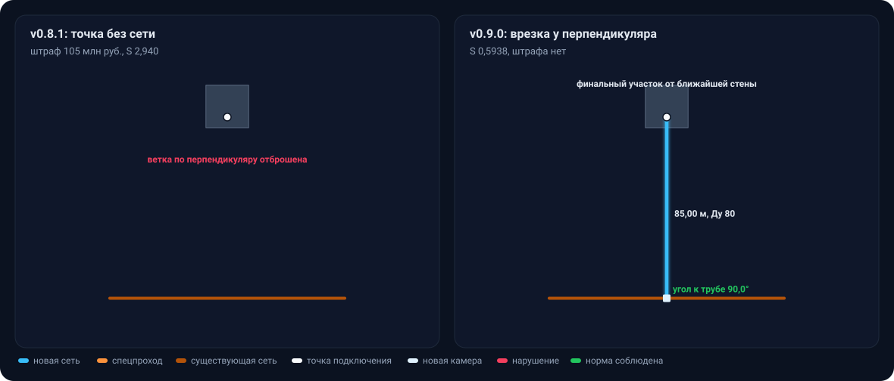

**Правила:** п. 2.2 — финальный прямой участок от ближайшей границы; п. 2.5 — неподключение только без допустимого маршрута. Вход `wall-pipe` — проба P1 аудита 27.09.

### Существующая камера ближе 10 м

**Что может пойти не так.** Проекция точки на трубу лежит в 7 м от существующей камеры. Новая камера у самой проекции дала бы трассу на 0,33 м короче при той же цене: камера на трубе Ду 300 стоит 5 млн руб., как и врезка в существующую. Но правило обязывает использовать существующую камеру.

**Что делает сервис.** Проекция не дальше 10 м от камеры со свободным местом становится врезкой в эту камеру: участок заканчивается в ней, в сводке одна врезка за 5 млн руб. Новой камеры нет.

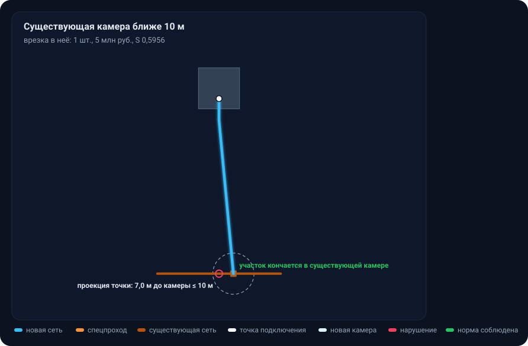

**Правила:** п. 2.4 и разъяснение 11 — «используется существующая камера»; check18 D9 ловит новую камеру в 10 м от существующей.

### Пересечение дороги

**Что может пойти не так.** Прямая от трубы к зданию пересекает дорогу под 30°, меньше допустимых 45°. Второй риск: проекция точки на трубу лежит в самой дороге, и камера врезки встала бы в проезжую часть, а спецпроход начинался бы в камере посреди полосы.

**Что делает сервис.** Граф не берёт ребро через дорогу под углом меньше 45°. Трасса доходит до края полосы, пересекает дорогу одним прямым отрезком под 90° и возвращается к зданию. Спецучасток — полигон дороги и по 3,00 м вдоль трассы с каждой стороны, всего 14,00 м; на его границах стоят технические узлы. Камеру врезки сервис переносит вдоль трубы за полосу 3 м от границы дороги: на картинке справа до дороги 3,04 м.

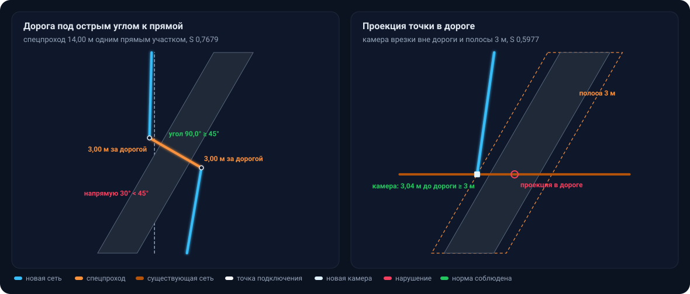

**Правила и нормы:**

- табл. 2 и разъяснение 6 — угол не меньше 45°, спецпроход одним прямым участком, «полигон дороги и по 3 м за границей», длина за границей отсчитывается вдоль трассы (разд. 4);
- СП 124.13330.2012 «Тепловые сети», п. 9.10 — пересечение дорог под углом не меньше 45°; п. 9.14 — футляр выводится на 3 м за пределы пересекаемого сооружения;
- техническая политика ГУП «ТЭК СПб», прил. 2 п. 4.7: «Исключить размещение … тепловых камер … в проезжей части дорог. При невозможности – рассматривать в индивидуальном порядке». Поэтому камера врезки остаётся в дороге, только если на трубе нет места вне полосы; check18 в остальных случаях считает её нарушением D11.

Входы: слева сценарий S06-02 (`road-cross`), справа `road-oblique`.

### Дорога, заданная линией

**Что может пойти не так.** В выгрузке рабочей системы дорога может прийти осью (LineString), а не полигоном. Приложение это допускает (разд. 1.1). v0.8.1 такой вход читала, но точку оставляла без сети, S 2,94.

**Что делает сервис.** Ось — полигон нулевой ширины. Спецучасток — по 3 м вдоль трассы в обе стороны от точки пересечения оси, угол меряется к звену оси (разъяснение 6: «для линейной геометрии он определяется относительно линии ограничения»). За спецучастком трасса держит от оси тот же отступ, что от полигона.

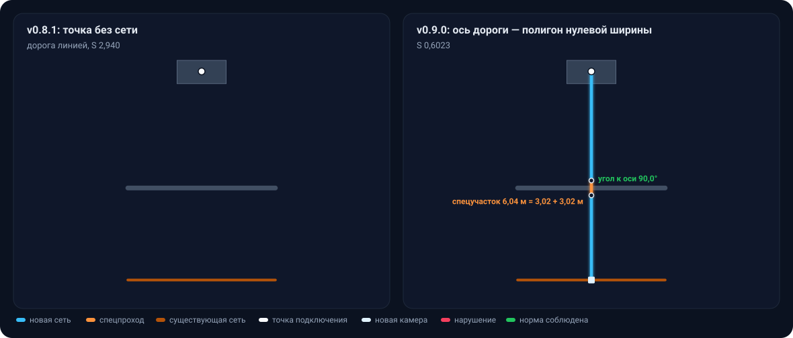

**Правила:** разд. 1.1, табл. 2, разъяснение 6. Вход `road-line` — проба T1.

### Острое пересечение газопровода

**Что может пойти не так.** Газопровод идёт примерно под 13° к прямой от трубы к зданию. Спецучасток у газопровода — только по 2 м от точки пересечения, а норма от оси газопровода больше: 2,0 м отступа + 0,235 м половины ширины Ду 80 + 0,2 м полуширины газопровода = 2,44 м. При остром угле трасса за спецучастком метрами идёт ближе нормы. Так было в v0.8.1: вне круга у пересечения 16,08 м трассы шли ближе нормы, местами в 0,58 м от оси газопровода.

**Что делает сервис.** Обычная часть трассы может быть ближе нормы только в круге радиусом «норма + 0,1 м» (здесь 2,54 м) вокруг точки пересечения: столько даёт пересечение под прямым углом. Граф не берёт ребро, у которого часть за спецучастком и кругом ближе нормы. Трасса поворачивает к газопроводу, пересекает его под 90° и уходит к зданию. S выше, 1,114 против 1,093: правильный маршрут длиннее.

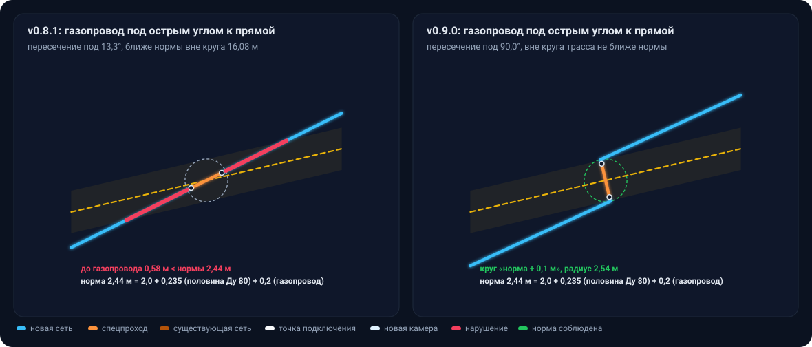

**Правила:** табл. 2 — у газопровода спецучасток «по 2 м с каждой стороны точки пересечения», отступ 2,0 м; разд. 4 и разъяснение 7 — отступ не проверяется только внутри спецпрохода. Для кабеля и линий типов-расширений правило то же. У существующей сети норма меньше 2 м, круг лежит внутри спецучастка, и трасса Ду 100 пересекает сеть Ду 100 под углом не меньше 49°. Вход `gas-acute`.

### Наложение зон: газопровод у дороги

**Что может пойти не так.** Газопровод проходит в 2 м от края дороги, и их спецзоны перекрываются. Если оформить всё одним спецучастком с коэффициентом дороги, внутри участка меняется набор пересекаемых объектов. В v0.8.1 так и было: check18 B14.

**Что делает сервис.** Технический узел ставится на каждой смене набора зон. Получается три спецучастка: зона одной дороги 15,00 м с Kспец 1,60, общий фрагмент дороги и газопровода 3,04 м с наибольшим коэффициентом 1,60 и зона одного газопровода 1,00 м с Kспец 1,25.

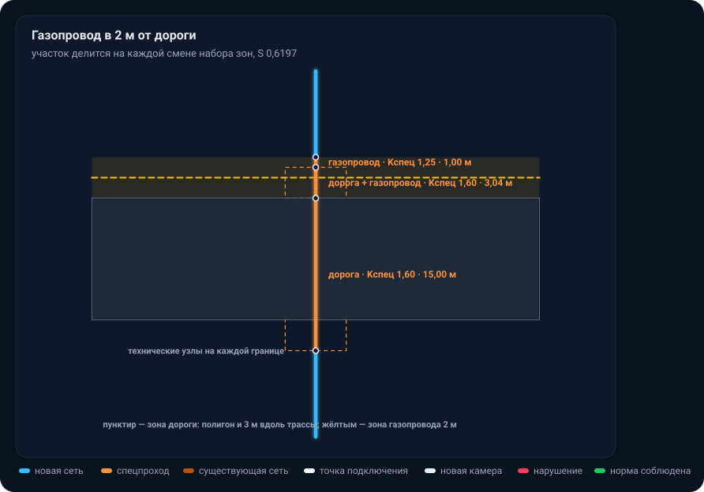

**Правила:** разд. 4 — «На границах общего фрагмента начинается новый участок», коэффициенты «не суммируются и не перемножаются»; разъяснение 8. Вход `gas-road`.

### Финальный участок у П-образного здания

**Что может пойти не так.** Точка стоит в крыле П-образного здания в 3 м от стены двора. Луч через ближайшую точку контура уходит во двор шириной 8 м и упирается в другое крыло: финальный участок вошёл бы в своё здание второй раз. Если взять эту точку, трасса нарушит п. 2.2. Если отказаться от неё целиком, точка останется без сети. v0.8.1 оставляла её без сети.

**Что делает сервис.** Перебирает точки контура через 5 см по возрастанию расстояния и берёт первую, где луч выходит из здания один раз и в зоне отступа не подходит к зданию снова. Здесь это внешняя стена крыла в 11,0 м от точки. Пунктир на картинке — зона отступа своего здания.

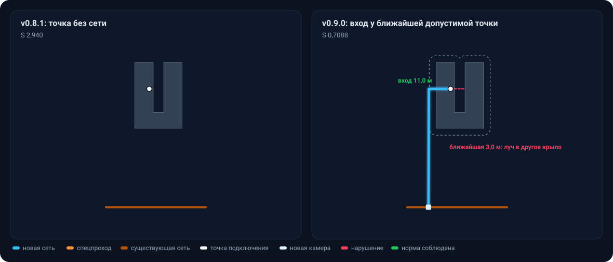

**Правила:** п. 2.2 и разъяснение 3 — «один финальный прямой участок от ближайшей к точке границы полигона». Толкование «ближайшей допустимой» — в [interpretation.md](interpretation.md), раздел «Форма трассы»; check18 проверяет вход (B8), повторный вход в своё здание (B4) и повторный заход в зону отступа (B19). Вход `u-building`.

### Поворот круче 90° в камере

**Что может пойти не так.** В камере ветвления участок начинается заново, но путь точки к врезке проходит через неё: от последнего звена одного участка к первому звену другого. В v0.8.1 ветки к северной и южной точкам сходились в камере так, что путь поворачивал на 104,04°.

**Что делает сервис.** Проход `turned` пробует сдвинуть камеру вдоль ребра или изломать звено у камеры. Здесь обе ветки изломаны в 2,1 м от камеры, повороты путей в ней 89,63° и 89,36°. Если так поворот не снять, сервис обходит камеру прямым звеном. Вариант, где поворот круче 90° остался, не выдаётся, если есть вариант без него.

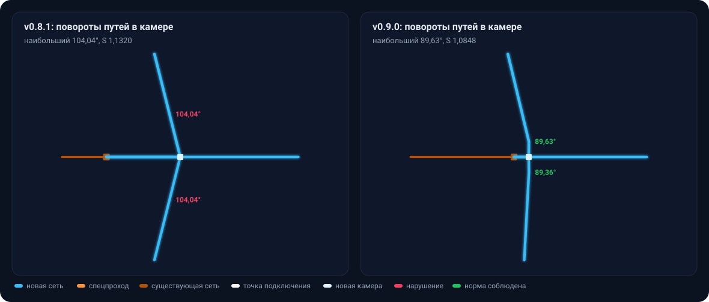

**Правила:** п. 2.1 — «Допускается произвольный угол поворота до 90° включительно»; разъяснение 5; check18 B20. Вход `turn-chamber` — сценарий S02-03.

### Строгая форма: без дуг, лишних вершин, двойных поворотов и зигзагов

**Что может пойти не так.** Маршрут по вершинам зон обходит угол здания цепочкой мелких изломов по 8°. Это плавная дуга из вершин, каждую из которых можно убрать, — «необоснованные мелкие изломы» по п. 2.1. В v0.8.1 у угла было четыре вершины, check18 B17.

**Что делает сервис.** Доводка формы убирает вершину, если соседей можно соединить прямой с запасом 0,15 м к зоне сверх нормы. Два поворота в одну сторону заменяет один, зигзаг спрямляет. У угла остаётся одна вершина 31,6°, трасса к тому же на 0,02 м короче.

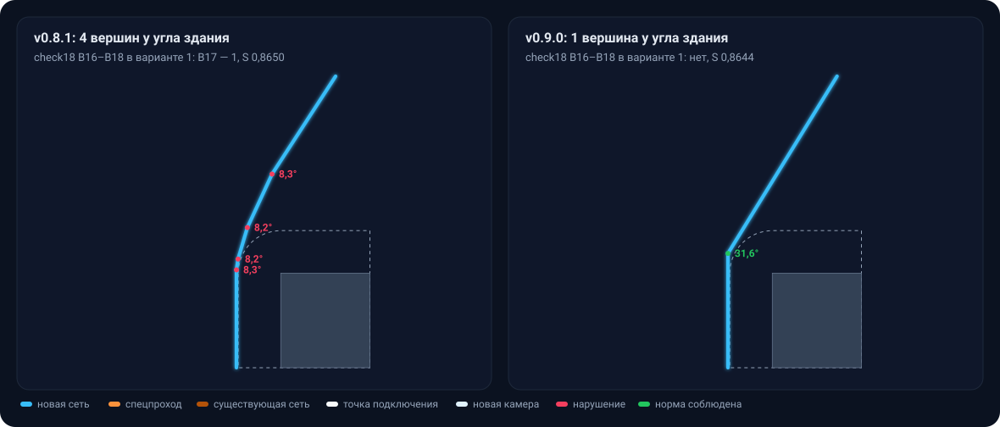

**Правила:** п. 2.1 и разъяснение 5 — «Трасса не должна содержать необоснованных мелких изломов, зигзагов и ступенчатых фрагментов»; когда поворот обоснован, записано в [interpretation.md](interpretation.md), раздел «Форма трассы». check18: B16 — лишняя вершина, B17 — двойной поворот, B18 — зигзаг, B21 — излом у камеры или технического узла, B22 — короткое звено у узла спецпрохода. Вход `strict-shape` — сценарий S05-05.

### Ступень Ду по предельной длине

**Что может пойти не так.** Точке с расходом 5,969 т/ч по пропускной способности хватает Ду 65 (до 8,3 т/ч). Но путь до врезки 335 м, а предельная длина Ду 65 — 245 м, Ду 80 — 327 м. Минимальный по расходу диаметр путь не проходит, а произвольно завышать Ду нельзя.

**Что делает сервис.** `DiameterPlanner` берёт следующий наименьший Ду, который проходит и по расходу, и по длине: Ду 100 с пределом 419 м. На ступень выше него сервис не поднимет, check18 считает это нарушением C6.

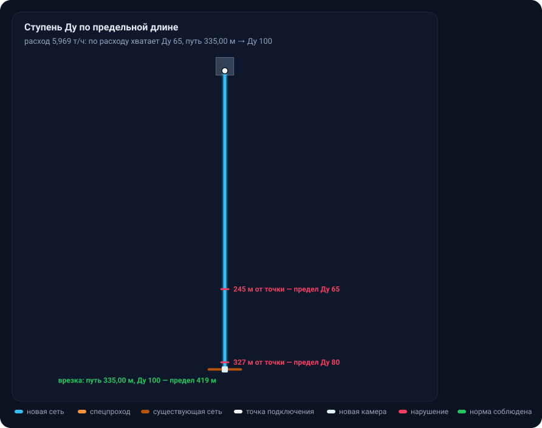

**Правила:** п. 2.3 и разъяснение 1 — «выбирается следующий минимальный ДУ, удовлетворяющий обоим условиям», «произвольное завышение ДУ не допускается»; разъяснение 2 — длина считается по каждому пути отдельно. Вход `dn-length`.

### Несвязная сеть и числовые id

Картинки здесь не нужны: это случаи чтения входа.

- **Участок сети, не связанный с источником** (`orphan-net`, проба T6). v0.8.1 отказывалась считать такой вход. v0.9.0 считает и печатает предупреждение `не связаны с источником по стыкам участков heat_network: 1, камер: 0; расчёт идёт, врезка в них допустима`. Основание: п. 1.1 требует от `heat_network` только `id`, `object_type` и `diameter`, а разъяснение 11 разрешает врезку в любой допустимой точке сети.
- **id точки `11.0`** (`id-float`, проба T11). v0.8.1 отвергала вход: «ожидается непустая строка или целое число, получено 11.0». v0.9.0 принимает любое число JSON и пишет ссылку в выход тем же числом: `"end_node_id": 11.0` (разд. 1: идентификатор «не интерпретируется по его формату»).

### Итог check18 по входам картинок

Строгий check18 проверяет все варианты файла выхода, в колонке v0.8.1 — нарушения варианта 1. Нарушение E7 у v0.8.1 есть почти везде: тогда `score` округлялся до трёх знаков, а п. 7.3 показывает четыре.

| Вход | Откуда | v0.9.0 | v0.8.1, вариант 1 |
|---|---|---|---|
| `wall-pipe` | проба P1 | CHECK18 OK | точка без сети |
| `chamber-10m` | свой | CHECK18 OK | E7 |
| `road-cross` | сценарий S06-02 | CHECK18 OK | E7 |
| `road-oblique` | свой | CHECK18 OK | E7 |
| `road-line` | проба T1 | CHECK18 OK | точка без сети |
| `gas-acute` | свой | CHECK18 OK | B10, E7 |
| `gas-road` | свой | CHECK18 OK | B14, E7 |
| `u-building` | свой | CHECK18 OK | точка без сети |
| `turn-chamber` | сценарий S02-03 | CHECK18 OK | B20, E7 |
| `strict-shape` | сценарий S05-05 | CHECK18 OK | B17, E7 |
| `dn-length` | свой | CHECK18 OK | нарушение E7 только в варианте 2 |
| `orphan-net` | проба T6 | CHECK18 OK | вход не принят |
| `id-float` | проба T11 | CHECK18 OK | вход не принят |

## Чего алгоритм не гарантирует

- **Минимум стоимости.** Дерево Такахаши–Мацуямы и локальный поиск — эвристика: сервис находит допустимое решение, но не доказывает, что дешевле нельзя.
- **Строгое соблюдение формы в городском режиме.** Районы большого входа не проходят проходы шага 8; при `heatnet.city.min=10` на малых наборах check18 выводит там строки B16–B21.
- **Режим с глубиной** не реализован: `depth_start` и `depth_end` — `null` (разд. 5 приложения, режим необязательный).

Остальные границы применения — в [BACKEND.md](../architecture/BACKEND.md#границы-применения).
